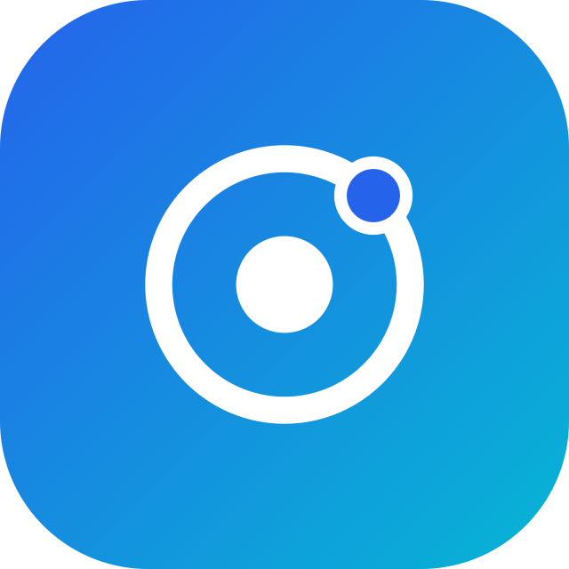

<div align="center">



# OraOne

**One AI. Every Conversation.**

AI Chat & WhatsApp agents that answer, qualify, and convert customers 24/7 — even when your team is offline.

[](https://github.com/OraOneHQ/oraone-web/actions/workflows/ci.yml)
[](https://github.com/OraOneHQ/oraone-web/actions/workflows/pages.yml)
[](https://oraone.in)
[](#license)

[Live Site](https://oraone.in) · [Documentation](docs/README.md) · [Architecture](docs/ARCHITECTURE.md) · [Backend / API](docs/BACKEND.md) · [Report an Issue](https://github.com/OraOneHQ/oraone-web/issues)

</div>

---

## What is OraOne?

OraOne is an **AI agent platform for customer conversations**. Businesses deploy
AI-powered agents across their website chat and WhatsApp that answer questions
from their own knowledge base, qualify leads, book meetings, and hand off to a
human when confidence is low — so no conversation goes unanswered, day or night.

It's a full production system: a marketing site, an authenticated dashboard for
managing agents/knowledge/integrations, a public REST API for developers, an
embeddable chat widget for any website, and a Super Admin control center for
platform operations.

## Key features

| | |
|---|---|
| 🤖 **Multi-channel AI agents** | One knowledge base, deployed to both website chat and WhatsApp with consistent tone and context. |
| 📚 **RAG knowledge base** | Upload PDFs/FAQs/docs — chunked and embedded (pgvector), retrieved with scored citations at answer time. |
| 💬 **Embeddable chat widget** | A single `<script>` tag; works with React, Next.js, WordPress, Shopify and plain HTML. |
| 🎯 **Lead qualification & capture** | Configurable qualification frameworks, auto-scoring, and CRM handoff via native integrations or webhooks. |
| 🔐 **Self-hosted authentication** | Argon2 password hashing + JWT access/refresh tokens + email OTP second factor — no third-party identity provider. |
| 📊 **Analytics & reporting** | Conversation, conversion, and channel-level dashboards. |
| 🛠️ **Public REST API** | A versioned `/api/v1` surface for developers to build on top of OraOne. |
| 🧑‍💼 **Super Admin Control Center** | Org/tenant management, entitlements, security, and platform operations tooling. |
| 🌐 **90+ languages** | Auto-detects visitor language and replies natively. |
| 🔒 **Security-first** | Tiered rate limiting, idempotency, CSP/HSTS security headers, audit logging, RBAC. |

## Architecture

<p align="center">
  
</p>

A single diagram covering the full system: client → edge/delivery → application →
data/storage → external services, one live chat conversation's numbered
end-to-end flow (1–9), and the CI/CD + deployment pipeline. See
[docs/ARCHITECTURE.md](docs/ARCHITECTURE.md) for the system overview, and
[Backend](docs/BACKEND.md), [Database](docs/DATABASE.md) and
[Deployment](docs/DEPLOYMENT.md) for focused diagrams on each piece (auth
flows, the transactional webhook outbox, Redis failure semantics,
deployment topologies, and more).

### Tech stack

| Layer | Technology |
|---|---|
| Frontend | React (Create React App + CRACO), Tailwind CSS, Framer Motion, React Query |
| Backend | FastAPI (Python), async SQLAlchemy 2.0, Alembic |
| Database | PostgreSQL 16 + pgvector (embeddings) |
| Cache / reliability | Redis (idempotency, rate limiting, refresh tokens) |
| Object storage | S3-compatible (MinIO locally, AWS S3 or any S3-compatible provider in production) |
| AI | Pluggable provider (OpenRouter / OpenAI-compatible), graceful mock fallback |
| Auth | Argon2 + JWT + Redis-backed refresh-token rotation, email OTP 2FA |
| Deployment | GitHub Pages (frontend, HTTPS enforced), Docker Compose + Caddy (backend, auto-HTTPS) |
| CI/CD | GitHub Actions — lint/test/build gate, decoupled from manual-dispatch deploys |

## Project structure

```
oraone-web/
├── frontend/            React SPA — marketing site, dashboard, admin console
│   ├── src/pages/       marketing/  dashboard/  admin/  auth/  onboarding/
│   ├── src/components/  shared design system + feature-scoped components
│   └── public/          static assets, favicon/app-icon, widget.js
├── backend/             FastAPI application
│   ├── app/api/         route modules (auth, agents, chat, knowledge, ...)
│   ├── app/services/    business logic (auth, agent runtime, RAG, billing, ...)
│   ├── app/middleware/  auth, rate limiting, idempotency, security headers
│   ├── app/database/    SQLAlchemy models + repositories
│   └── alembic/         database migrations
├── docs/                architecture, API reference, product guide, runbooks
├── scripts/             deployment + diagram/asset regeneration tooling
├── docker-compose.dev.yml   Postgres + Redis + MinIO for local development
├── docker-compose.prod.yml  full self-hosted stack (+ backend/frontend/Caddy)
└── Caddyfile            reverse proxy + automatic HTTPS config
```

## Getting started

```bash
git clone https://github.com/OraOneHQ/oraone-web.git
cd oraone-web

# Postgres + Redis + MinIO
docker compose -f docker-compose.dev.yml up -d

# Backend
cd backend
python -m venv .venv && source .venv/bin/activate   # Windows: .venv\Scripts\activate
pip install -r requirements.txt
cp .env.example .env   # set JWT_SECRET_KEY and DATABASE_URL — see file for details
alembic upgrade head
uvicorn server:app --reload --port 8000

# Frontend (in a new terminal)
cd frontend
yarn install
yarn start
```

Open http://localhost:3000 and sign in with the seeded local admin account.
No AWS account, Cognito, or MongoDB required — the whole stack is self-hosted.

**Full walkthrough (env vars, troubleshooting, production Docker images):**
see [LOCAL_SETUP.md](LOCAL_SETUP.md).

## Documentation

| Guide | What it covers |
|---|---|
| [Architecture](docs/ARCHITECTURE.md) | Top-level system overview, trust boundaries, security posture — the one diagram to start with. |
| [Features](docs/FEATURES.md) | Key features, product structure, plans & limits. |
| [UML Diagrams](docs/UML.md) | Use-case, class, and sequence diagrams for every major flow. |
| [Frontend](docs/FRONTEND.md) | React/CRA architecture, directory structure, GitHub Pages routing, brand identity. |
| [Backend](docs/BACKEND.md) | FastAPI request lifecycle, middleware, auth flows, chat system, and the public REST API (`/api/v1`). |
| [Database](docs/DATABASE.md) | PostgreSQL schema (ER diagram + fields) and Redis usage/failure semantics. |
| [Deployment](docs/DEPLOYMENT.md) | Deployment topologies, CI/CD, health checks, incident response, backups, scaling. |
| [Routes](docs/ROUTES.md) | Every front-end route, grouped by area, with auth requirements. |
| [Environment Variables](docs/ENVIRONMENT.md) | Every backend env var, whether required, and safe defaults. |

See [docs/README.md](docs/README.md) for the full documentation index.

## Security

Tiered Redis-backed rate limiting, idempotency keys on mutating requests,
CSP/HSTS/security headers, Argon2 password hashing, JWT access/refresh tokens
with rotation + reuse detection, email OTP as a second factor, fail-closed
authorization on unknown entitlements, and structured audit logging. See
[docs/ARCHITECTURE.md](docs/ARCHITECTURE.md#security-posture) for the full
posture. Found a vulnerability? Please report it privately rather than via a
public issue.

## License

© OraOne Technologies. All rights reserved. This is proprietary software —
see the repository owner for licensing/usage terms.
