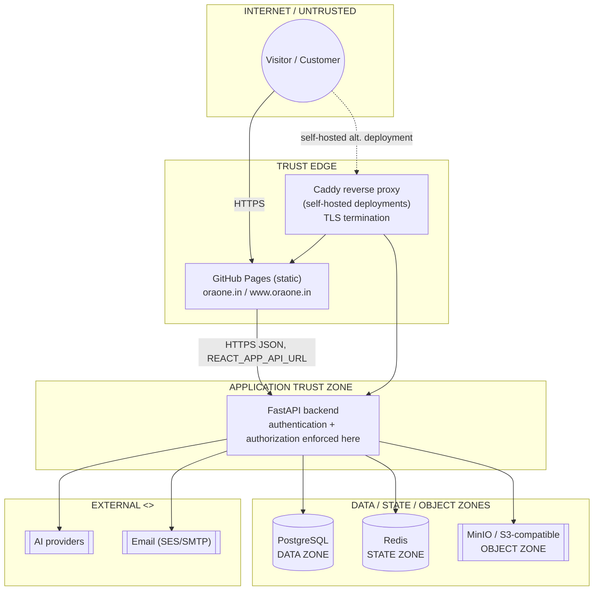

# OraOne — Architecture

This document is the top-level system overview. For detail, see the
focused docs it links out to: [Features](FEATURES.md), [Frontend](FRONTEND.md),
[Backend](BACKEND.md), [Database](DATABASE.md), [Deployment](DEPLOYMENT.md),
[Routes](ROUTES.md), [Environment](ENVIRONMENT.md).

OraOne is a fully self-hosted stack (no AWS dependency of any kind) with
self-hosted authentication, a Postgres system of record, Redis-backed
reliability primitives, and a static frontend on GitHub Pages fronted by a
custom domain with a real TLS certificate.

## Complete system overview (one diagram)


A single rendered image combining the system architecture, one live chat
conversation's numbered end-to-end flow (1-9), and the CI/CD + deployment
pipeline. Regenerate from `scripts/diagram/architecture.mmd` (see that
file's header comment) if the topology changes.

## Legend

```
──────>   synchronous call (caller blocks for the response)
- - - ->  asynchronous / event flow (caller does not wait)
[Component]     an application or infrastructure component
((Database))    persistent state
<<External>>    a third-party/external system
[Trust Boundary] a security boundary — components on either side do not
                 share the same trust level
```

Component grouping used throughout: **Client** (browser/API caller),
**Application** (FastAPI + routers/services), **Infrastructure** (Postgres,
Redis, MinIO, Caddy), **External** (AI providers, email), **Observability**
(logs/traces).

---

## System overview & trust boundaries



Reading this diagram should immediately answer:

- **Where does untrusted input enter?** Only via `Pages`/`Proxy` at the
  trust edge — nothing in `AppZone` or `DataZone` is directly internet-facing.
- **Where is authentication established, and where is it enforced?**
  Inside the FastAPI application (see [Backend](BACKEND.md)) — never at the
  edge/proxy layer.
- **Which components may talk directly to Postgres?** Only the FastAPI
  application — nothing else has DB credentials.
- **Which components are externally reachable?** `Pages` and `Proxy` only;
  Postgres/Redis/MinIO are never bound to a public interface.

**Frontend** is a fully static Single Page Application, deployed to GitHub
Pages via `.github/workflows/pages.yml` on every push to `main` — see
[Frontend](FRONTEND.md). **Backend** is a separate, independently deployable
FastAPI service — containerized (`backend/Dockerfile`) and run under
Gunicorn in production — see [Backend](BACKEND.md) and
[Deployment](DEPLOYMENT.md) for why "GitHub Pages" and "Caddy" are **two
distinct deployment models**, not one topology.

## Security posture

| Control | Status |
|---|---|
| Security headers (CSP, HSTS, X-Frame-Options, nosniff, Permissions-Policy, COOP) | ✅ `security_headers_mw` |
| CORS allow-list | ✅ env-driven (`CORS_ORIGINS`), never `*` with credentials |
| Tiered rate limiting (password/auth/ai/api) | ✅ Redis-backed, fails open |
| Idempotency on mutating requests | ✅ Redis-backed, fails closed |
| Self-hosted auth: Argon2 + JWT + email OTP | ✅ no external identity provider — see [Backend](BACKEND.md#authentication--authorization--distinct-stages) |
| httpOnly/SameSite auth cookies | ✅ defense-in-depth alongside bearer JWT |
| Input validation | ✅ Pydantic schemas on every request body |
| AuthZ fail-closed | ✅ unknown product/feature/permission → deny |
| Structured logging, no secrets in logs | ✅ structlog JSON, no headers/bodies |
| Secret management | ✅ env vars only; `.gitignore` covers `.env`, `*.pem` |
| Dependency vulnerability scanning | ✅ `pip-audit` run manually each release; not yet a CI gate (recommended next step) |
| HTTPS everywhere | ✅ GitHub Pages cert (Let's Encrypt) for the frontend; Caddy auto-HTTPS for self-hosted deployments |
| Disaster recovery | ✅ `backend/scripts/backup_restore_drill.py` — see [Deployment](DEPLOYMENT.md#backups--disaster-recovery) |

## Deferred by design

These are **intentionally** not part of the current architecture — their
absence is a scoping decision, not architectural debt, and each has a
concrete trigger condition for revisiting:

| Deferred | Revisit when |
|---|---|
| CQRS | Read and write query patterns/load diverge enough that one model can't serve both efficiently. |
| Microservice decomposition | Multiple teams need independent release trains for different bounded contexts. |
| External API versioning (`/api/v2` for internal dashboard routes) | A breaking change to internal routes is unavoidable and can't be made additive. |
| Kafka / dedicated event bus | Webhook/outbox throughput or consumer count outgrows a single Postgres-backed queue. |
| Full frontend feature-based restructure (all domains) | Ongoing — only the `agents` domain is fully migrated to React Query today. |
| Vite migration | A CI environment can run the full authenticated route matrix and a dedicated migration window exists. |
| Kubernetes | Traffic/ops complexity outgrows a single Docker Compose host or a handful of container instances. |

If this document plus [Features](FEATURES.md), [Frontend](FRONTEND.md),
[Backend](BACKEND.md), [Database](DATABASE.md), [Deployment](DEPLOYMENT.md)
and [Routes](ROUTES.md) answer, for any engineer new to the codebase: what
the product does, where a request enters, where auth/authorization happen,
where data lives, which operations are async, what happens when a
dependency fails, how production is deployed and recovered, and what's
deliberately out of scope — this document set is doing its job.
