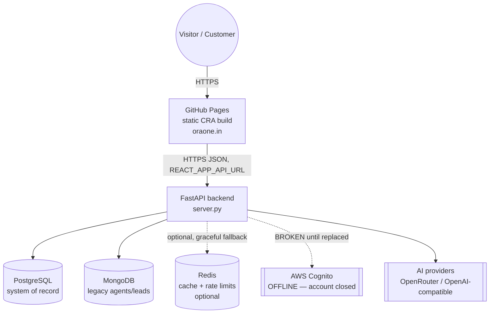
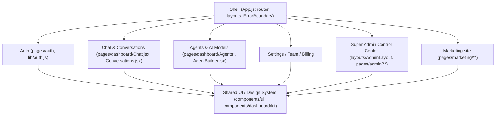
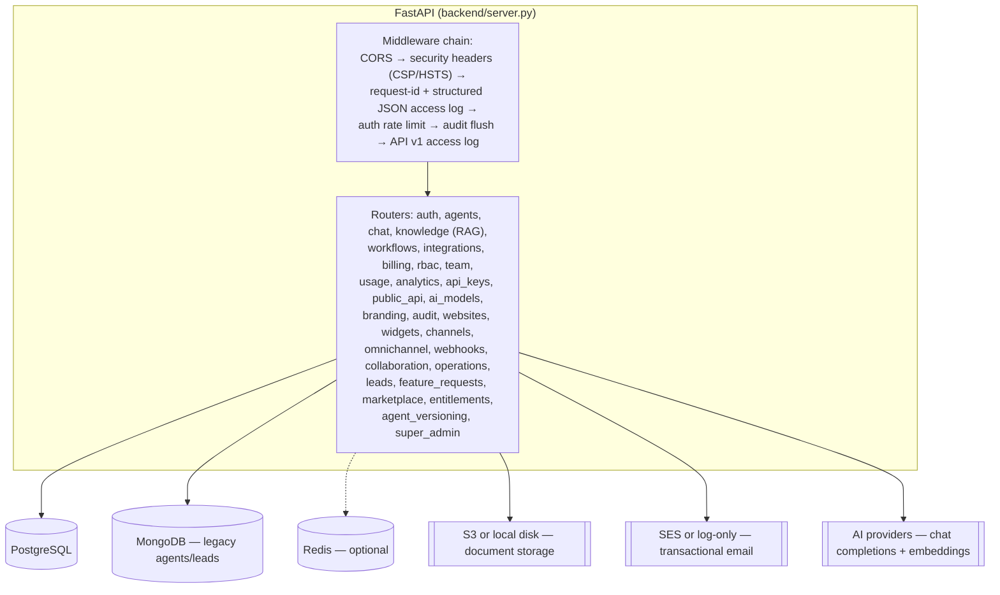
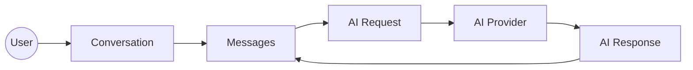
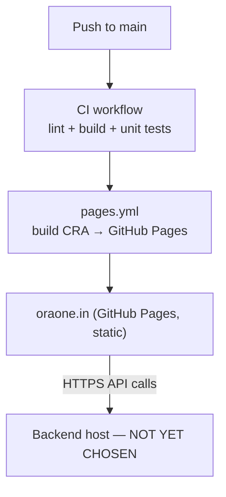

# OraOne — Architecture

This document describes the current architecture of the **OraOne Chat
Platform** after the removal of the discontinued Voice Platform (Product 2),
and the target deployment model now that AWS is no longer available.

---

## 1. System overview



**Frontend** is a fully static Single Page Application, independently
deployable to GitHub Pages. **Backend** is a separate FastAPI service that is
*not* hosted on GitHub Pages (GitHub Pages cannot run a server) — it needs its
own host, which is currently **undecided** (see §6).

---

## 2. Frontend architecture

### 2.1 Why CRA/CRACO, not Vite (yet)

The frontend is a mature Create React App (via CRACO for path aliases and a
custom webpack health-check plugin) with ~150 route-level pages and a large
shared component/design-system layer. A wholesale migration to Vite is
**technically straightforward but operationally risky** without a full
regression test suite and a live staging environment to validate every route
— neither is available while the backend's AWS dependencies (Cognito, RDS)
are unresolved. Per the Google-style engineering principle of *simplicity
over unnecessary abstraction* and *not introducing complexity you can't yet
validate*, this migration is deliberately deferred rather than attempted
blind. It remains a good next step once:

1. A CI environment can run the full authenticated route matrix against a
   real (non-AWS) backend, and
2. A dedicated migration window exists to fix the inevitable CRA-only
   assumptions (e.g. `process.env.REACT_APP_*`, `public/` asset paths,
   CRACO's webpack overrides for path aliases and the health-check plugin).

When it happens, `@` path aliases, the `REACT_APP_*` env convention (→
`VITE_*`), and `public/index.html` (→ Vite's own HTML entry + plugin-based
SEO/meta injection) are the main touch points.

### 2.2 Why not a runtime microfrontend split (yet)

The codebase already has strong **internal** modularity: `features/`-style
route grouping under `src/pages/{marketing,dashboard,admin,auth,onboarding}`,
a shared design system (`src/components/ui`, `src/components/dashboard/kit`),
a single API client (`src/lib/api.js`), and a single auth context
(`src/lib/auth.js`). These are the *bounded contexts* a microfrontend
architecture would otherwise have to invent from scratch:



A **runtime** microfrontend split (Module Federation, separately deployed
bundles per team) would add real value once multiple teams need to ship
these surfaces independently with separate release trains. Today there is a
single frontend team and a single deploy target (GitHub Pages), so splitting
now would add build/runtime complexity (shared dependency de-duplication,
cross-bundle versioning, federation host/remote wiring) without a
corresponding ownership boundary to justify it. The module boundaries above
are documented and enforced by convention (imports only flow
`page → shared`, never `page → page`) so the codebase is ready to be split
later without a rewrite.

### 2.3 Next.js

Next.js is **not used**. The marketing site is fully static, pre-rendered at
build time by CRA, and served from GitHub Pages with per-route SEO metadata
already injected via `src/lib/seo.js` (`useSEO` hook) — this gets the same
SEO outcome (correct `<title>`, meta description, canonical, Open Graph)
without a second framework, a second build pipeline, or a second deployment
target. Introducing Next.js would only be justified if the app needed true
per-request server-side rendering or ISR (e.g. dynamic marketing pages
generated from a CMS) — it does not.

### 2.4 Directory structure

```
frontend/src/
  pages/           # route-level components, grouped by bounded context
    marketing/      admin/       dashboard/     auth/        onboarding/
    demos/          legal/       public/
  components/      # shared design system + feature-scoped components
    ui/             dashboard/   marketing/     admin/       auth/
  layouts/         # MarketingLayout, DashboardLayout, OnboardingLayout, AdminLayout
  lib/             # api client, auth context, seo hook, entitlements
  hooks/  services/  store/  constants/  types/  utils/
```

### 2.5 GitHub Pages + client-side routing

GitHub Pages has no server-side rewrite rules, so a direct load of a
client-routed path (e.g. `oraone.in/products`) 404s by default. This is
solved with the standard SPA-on-GitHub-Pages redirect trick:

- `public/404.html` — GitHub Pages serves this for any unknown path; it
  round-trips the real path through a query string and redirects to `/`.
- `public/index.html` — a small inline script restores the real path via
  `history.replaceState` before React Router mounts.
- `public/CNAME` — pins the custom domain `oraone.in`.

---

## 3. Backend architecture



### 3.1 Why FastAPI only (not Express + FastAPI)

There is currently **no Node.js/Express service** in this codebase — the
entire backend is a single FastAPI application. Introducing an Express BFF
layer purely to match a generic "Express handles auth/gateway, FastAPI
handles AI" template would duplicate request validation, CORS, rate
limiting, and auth logic that already exists and is tested in FastAPI, for
no functional gain today. FastAPI already:

- serves as the API gateway/BFF (routing, validation via Pydantic, CORS,
  rate limiting, security headers — see the middleware chain above),
- **and** hosts the AI orchestration (`app/services/agent_runtime.py`,
  `app/providers/*`, the RAG pipeline under `app/services/rag*`).

A Node/Express layer would earn its place if/when a genuinely
Node-ecosystem-only capability is needed (e.g. a specific SDK, a
WebSocket-heavy realtime layer separate from the API, or splitting
gateway-only concerns onto infrastructure that scales independently from AI
orchestration). Until then, one well-tested service is simpler to operate,
secure, and deploy than two.

### 3.2 Middleware chain (defense in depth)

| Layer | Responsibility |
|---|---|
| `CORSMiddleware` | Origin allow-list via `CORS_ORIGINS` env var (never hardcoded). |
| `security_headers_mw` | `X-Content-Type-Options`, `X-Frame-Options`, `Referrer-Policy`, `Permissions-Policy`, `Cross-Origin-Opener-Policy`, `Content-Security-Policy` (strict `default-src 'none'`, relaxed only for `/docs` `/redoc`), `Strict-Transport-Security` over HTTPS. |
| `request_context_mw` | Generates/propagates `X-Request-Id`; emits one structured JSON access-log line per request (`requestId`, `method`, `path`, `statusCode`, `durationMs`, `userId`, `ip`) via a dedicated `app.access` logger. Never logs headers, bodies, or secrets. |
| `auth_rate_limit_mw` | Fixed-window (1 min) brute-force protection on `POST /api/auth/*`, backed by the Redis-ready cache abstraction (`app/services/cache.py`). |
| `audit_flush_mw` | Persists buffered audit-log records after each request. |
| `api_v1_access_log_mw` | Per-API-key request logging for the public `/api/v1` surface (quota/usage attribution). |

### 3.3 Authentication & authorization

- **Authentication**: AWS Cognito (JWKS-verified JWT), see
  `app/middleware/jwt_auth.py` and `app/services/auth_service.py`.
  **Currently non-functional** — the AWS account is closed. This was
  deliberately left untouched in this modernization pass (auth is
  security-critical and was explicitly out of scope for this round); see
  `LOCAL_SETUP.md` §8 for the replacement options under consideration
  (new Cognito pool, self-hosted JWT + bcrypt, or a third-party provider
  such as Auth0/Clerk/Supabase Auth).
- **Authorization**: `app/services/authorization.py` — a single
  `authorize()` pipeline evaluating, in order: authentication →
  subscription status → product entitlement (fail-closed; unknown products
  deny) → feature flag → permission (RBAC). Every protected endpoint calls
  this **server-side**; the frontend's `ProductGate` component
  (`components/ProductRoute.jsx`) only controls *what's shown*, never what's
  *allowed* — the backend is the sole source of truth.
- **RBAC**: `UserRole` (`owner` / `admin` / `member`) plus per-permission
  checks (e.g. `agents.write`).

### 3.4 Redis usage

Redis is used behind the `CacheBackend` abstraction
(`app/services/cache.py`), which already implements:

- `InProcessCacheBackend` — default; single-node, no cross-node sync.
- `RedisCacheBackend` — JSON-serialised values under a namespaced key with a
  **native TTL** (Redis owns expiry), plus a pub/sub invalidation channel for
  cross-node cache busting.

Selection is via env vars (`ENTITLEMENTS_CACHE_BACKEND=redis`, `REDIS_URL=...`)
and **fails open to in-process** if Redis is unavailable or the `redis`
package isn't installed — the app never crashes because Redis is down.

Current consumers:

| Use | Key pattern | TTL | Failure behaviour |
|---|---|---|---|
| Entitlement snapshot cache | `oraone:ent:<org_id>` | short (config'd in `entitlements.py`) | Falls back to a fresh DB read. |
| Auth brute-force rate limit | `authrl:<ip>:<path>:<minute-bucket>` | 90s | Fails open (never blocks login on a cache error). |

Not cached: conversation content, message bodies, anything containing PII —
only counters and entitlement booleans.

### 3.5 Database

PostgreSQL via async SQLAlchemy + Alembic (`backend/alembic/versions/`).
Highlights relevant to this modernization pass:

- `agent_channels` (shared omnichannel channel bindings — chat/WhatsApp/
  email/API) was extracted from the removed voice-platform model file into
  `app/database/models/agent_channel.py` so it can be reused without any
  voice-specific baggage.
- Migration `0043_drop_voice_platform` removes every voice-exclusive table
  (`voice_calls`, `voice_profiles`, `voice_campaigns`, `receptionist_profiles`,
  etc. — 18 tables total) and the `voice_platform` product/entitlement rows.
  It is intentionally a one-way migration (`downgrade()` raises) since this
  is a genuine product removal, not a reversible schema tweak.
- Indexes follow the query patterns that use them — e.g.
  `ix_agent_channels_channel`, `ix_conversations_organization_id` — added
  when a filter/join needs one, not speculatively.

### 3.6 Storage & email portability (no AWS lock-in)

- **File storage** (`app/services/storage.py`): S3 when `S3_BUCKET` is set,
  otherwise a local-disk fallback under `UPLOAD_DIR` — already
  provider-agnostic; pointing `S3_BUCKET`/`S3_REGION`/a custom endpoint at
  any S3-compatible provider (Cloudflare R2, MinIO, Backblaze B2) works
  without code changes.
- **Email** (`app/services/email_service.py`): sends via SES when
  `EMAIL_FROM` + AWS credentials are present, otherwise logs the rendered
  email and returns `False` — callers never crash because email isn't
  configured. Swapping SES for an SMTP provider (Resend/Postmark/SendGrid)
  is a contained change to this one module.
- **AI embeddings/completions**: pluggable provider layer
  (`app/providers/*`) already defaults to OpenRouter/OpenAI-compatible
  APIs; AWS Bedrock is one optional provider among several, not a hard
  dependency.

---

## 4. Chat system architecture



- **Conversations** are channel-tagged (`chat`, `whatsapp`, `sms`, `email`,
  `messenger`, `instagram`, `telegram`, `slack` — `voice` was removed).
- **Pagination**: conversation lists and message history use cursor/offset
  pagination (`limit`/`offset` query params) rather than loading full
  history — see `app/api/chat/routes.py`.
- **Identity**: `VisitorProfile` links the same person across channels
  (e.g. website chat + WhatsApp) via phone/email aliasing.
- **Resilience**: AI provider calls are wrapped with timeout + retry +
  graceful degradation to a mock/extractive responder when no provider key
  is configured, so a missing API key never 500s the chat endpoint.

---

## 5. Security posture

| Control | Status |
|---|---|
| Security headers (CSP, HSTS, X-Frame-Options, nosniff, Permissions-Policy, COOP) | ✅ `security_headers_mw` |
| CORS allow-list | ✅ env-driven (`CORS_ORIGINS`), never `*` with credentials |
| Rate limiting | ✅ per-API-key (public API), per-visitor (widget), auth brute-force (new) |
| Input validation | ✅ Pydantic schemas on every request body |
| AuthZ fail-closed | ✅ unknown product/feature/permission → deny |
| Structured logging, no secrets in logs | ✅ `request_context_mw` (JSON, no headers/bodies) |
| Secret management | ✅ env vars only; `.gitignore` covers `.env`, `*.pem`; leaked `product2.txt` removed from the working tree (rotate the keys it contained — removal doesn't invalidate them) |
| Dependency audit | ⚠️ not yet automated in CI — recommended: `pip-audit` / `yarn audit` as a CI step |
| Auth (Cognito) | 🔴 offline (AWS account closed) — see §3.3 |

---

## 6. Deployment



- **Frontend**: `.github/workflows/pages.yml` builds the CRA app and deploys
  it to GitHub Pages on every push to `main` that touches `frontend/**`.
  Custom domain `oraone.in` is preserved via `frontend/public/CNAME`.
- **CI**: `.github/workflows/ci.yml` runs on every push/PR — frontend
  lint+build, backend syntax check + import check + the DB-independent unit
  test suite. This gate must pass before merging; it does not deploy
  anything.
- **Backend**: **not currently deployed anywhere**, but is now fully
  containerized (`backend/Dockerfile` — multi-stage, non-root user, runs
  `alembic upgrade head` then `uvicorn` — built and smoke-tested as
  `oraone-backend:v1.0.0`). The previous pipeline (`.github/workflows/deploy.yml`)
  targeted a self-hosted AWS EC2 runner that no longer exists; it has been
  changed to `workflow_dispatch`-only (manual) so it can't fail CI
  automatically, and is kept only as a reference for the
  deploy/health-check/rollback steps a future host will need. Candidates:
  any container host (Fly.io, Render, Railway, a VPS + Docker/systemd) — all
  support Postgres + Redis + a long-running container without AWS.
- **Frontend Docker image**: `frontend/Dockerfile` (multi-stage — CRA build
  → nginx, non-root-safe on port 8080, SPA fallback routing in `nginx.conf`)
  is an alternative to GitHub Pages for self-hosted static deployments,
  built and smoke-tested as `oraone-frontend:v1.0.0`.
- **Local "run everything" stack**: `docker-compose.prod.yml` wires
  Postgres (pgvector) + Redis + the backend image + the frontend image
  together for a production-shaped local run: `docker compose -f
  docker-compose.prod.yml up -d --build`.
- **Environment separation**: frontend only ever sees `REACT_APP_*`
  (public) variables; all secrets (`DATABASE_URL`, `JWT`/Cognito config,
  `OPENROUTER_API_KEY`, etc.) stay server-side in `backend/.env`, which is
  never bundled into the static frontend build or the backend image (see
  `backend/.dockerignore` / `frontend/.dockerignore`). `backend/.env.example`
  and `frontend/.env.example` are the committed, secret-free templates.

---

## 7. Observability & failure handling

- Every HTTP response carries `X-Request-Id` for cross-log correlation.
- Structured JSON access logs (`app.access` logger) are ready to ship to any
  log aggregator (CloudWatch, Loki, Datadog) without a code change — just
  point the process's stdout at the collector.
- Audit log (`app.services.audit`) records privileged actions
  (create/update/delete on sensitive resources) separately from request
  access logs.
- Graceful degradation is the default posture: Redis down → in-process
  cache; AI provider unset → mock/extractive response; S3 unset → local
  disk; SES unset → log-only email. The one exception is Cognito, which has
  no fallback today (see §3.3) — this is the top follow-up item.

---

## 8. Scalability

- FastAPI is stateless per-request (no in-memory session affinity required)
  except for the in-process cache fallback, which is why the Redis backend
  exists for true multi-node deployments.
- Database indexes are aligned to the actual query patterns (organization
  scoping, status filters, timestamp range scans) rather than added
  speculatively — see `app/database/models/*.py` `__table_args__`.
- The frontend is a static bundle behind GitHub Pages' CDN — it scales
  independently of the backend by construction.
