# OraOne — Architecture

This document describes the current architecture of the **OraOne Chat
Platform**: a fully self-hosted stack (no AWS dependency of any kind) with
self-hosted authentication, a Postgres system of record, Redis-backed
reliability primitives, and a static frontend on GitHub Pages fronted by a
custom domain with a real TLS certificate.

## Complete system overview (one diagram)

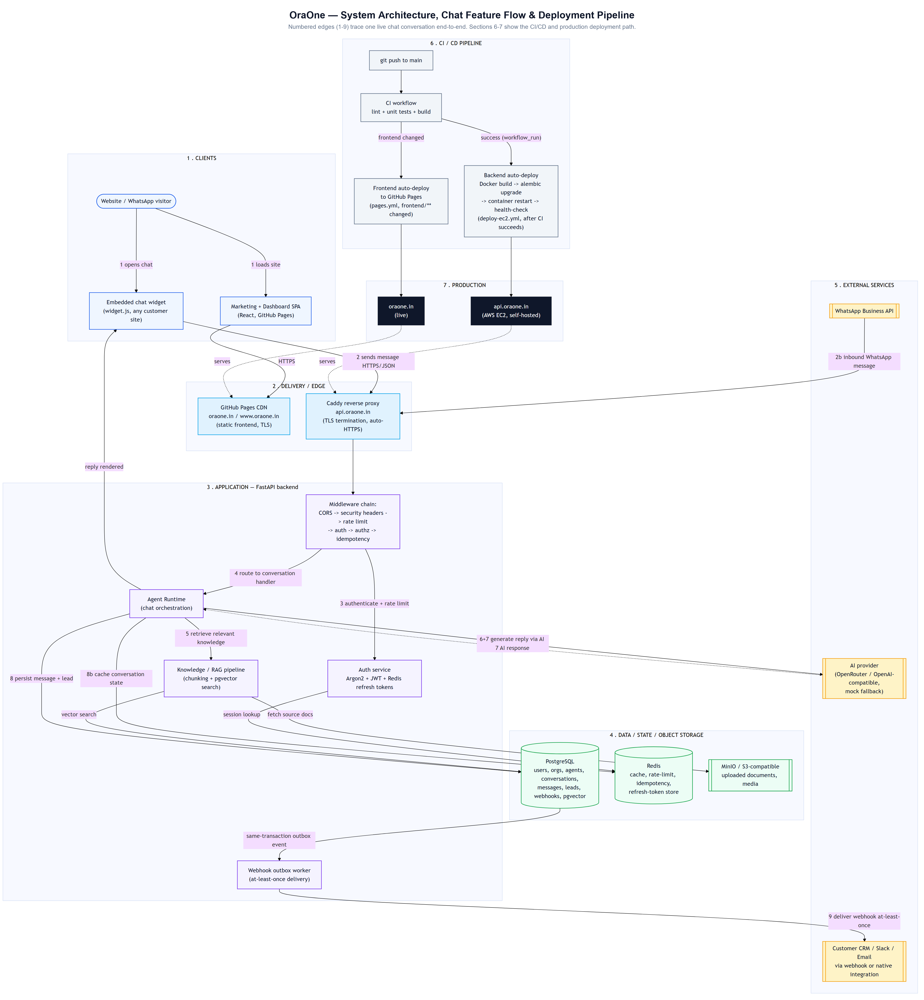

A single rendered image combining the system architecture, one live chat
conversation's numbered end-to-end flow (1-9), and the CI/CD + deployment
pipeline. The sections below break each part out in more detail with
focused Mermaid diagrams; regenerate the image from
`scripts/diagram/architecture.mmd` (see that file's header comment) if the
topology changes.

## What makes OraOne, OraOne (feature overview)

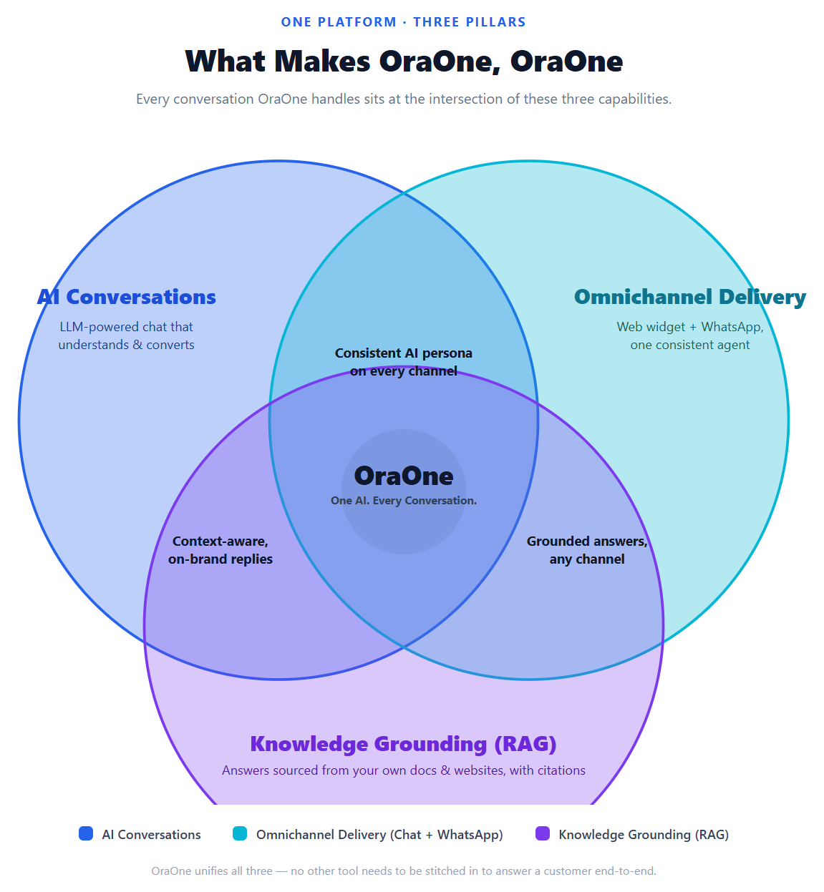

OraOne's product is the intersection of three capabilities, not any one of
them alone: LLM-powered **AI Conversations**, **Omnichannel Delivery**
(web widget + WhatsApp behind one agent), and **Knowledge Grounding (RAG)**
(citing your own documents/websites instead of hallucinating). Regenerate
from `scripts/diagram/feature-venn.html` (open it in a browser and
screenshot/re-export) if the pillars change.

## Legend

Notation used in every diagram below:

```
──────>   synchronous call (caller blocks for the response)
- - - ->  asynchronous / event flow (caller does not wait)
[Component]     an application or infrastructure component
((Database))    persistent state
<<External>>    a third-party/external system
[Trust Boundary] a security boundary — components on either side do not
                 share the same trust level
```

Component grouping used throughout: **Client** (browser/API caller),
**Application** (FastAPI + routers/services), **Infrastructure** (Postgres,
Redis, MinIO, Caddy), **External** (AI providers, email), **Observability**
(logs/traces).

---

## 1. System overview & trust boundaries

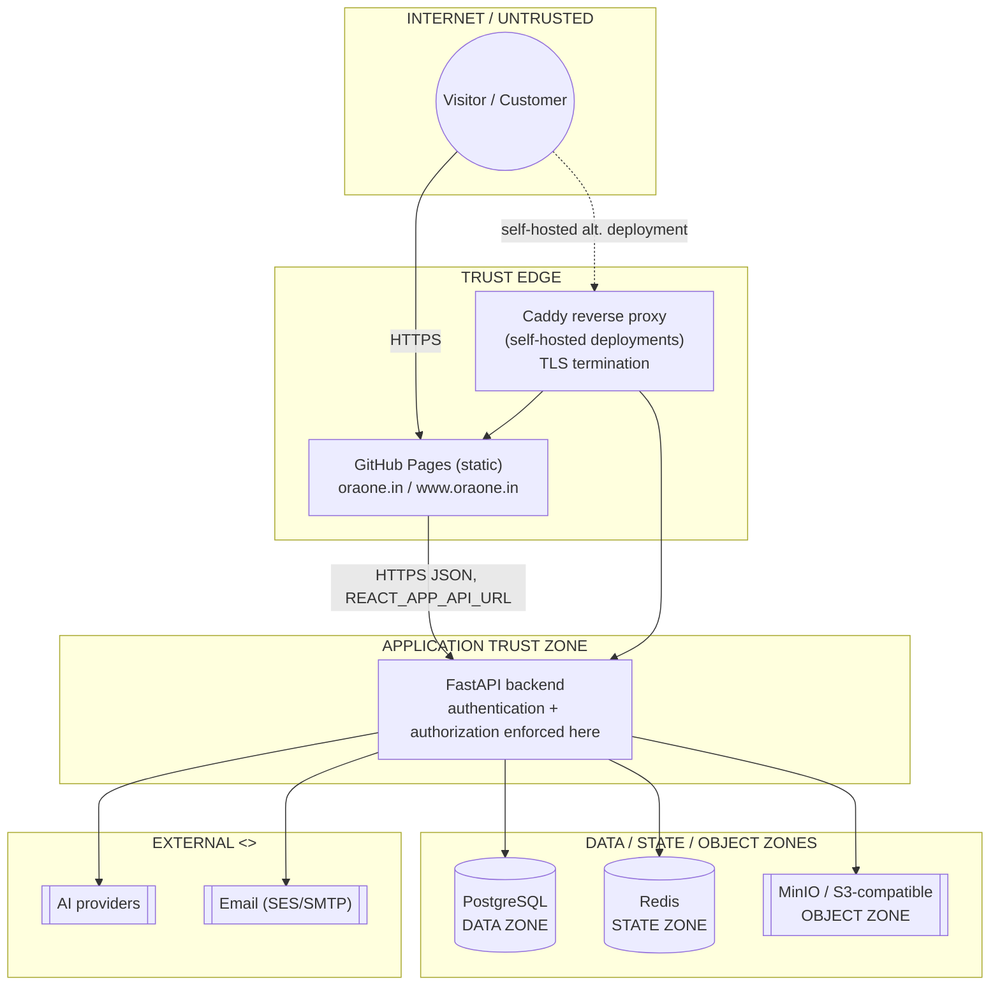

Reading this diagram should immediately answer:

- **Where does untrusted input enter?** Only via `Pages`/`Proxy` at the
  trust edge — nothing in `AppZone` or `DataZone` is directly internet-facing.
- **Where is authentication established, and where is it enforced?**
  Inside the FastAPI application (§3.4) — never at the edge/proxy layer.
- **Which components may talk directly to Postgres?** Only the FastAPI
  application — nothing else has DB credentials.
- **Which components are externally reachable?** `Pages` and `Proxy` only;
  Postgres/Redis/MinIO are never bound to a public interface.

**Frontend** is a fully static Single Page Application, deployed to GitHub
Pages via `.github/workflows/pages.yml` on every push to `main`. **Backend**
is a separate, independently deployable FastAPI service — containerized
(`backend/Dockerfile`) and run under Gunicorn in production. See §6 for why
"GitHub Pages" and "Caddy" are **two distinct deployment models**, not one
topology.

---

## 2. Frontend architecture

### 2.1 Why CRA/CRACO, not Vite (yet)

The frontend is a mature Create React App (via CRACO for path aliases and a
custom webpack health-check plugin) with 160+ route-level pages and a large
shared component/design-system layer. A wholesale migration to Vite is
technically straightforward but is deliberately deferred until a dedicated
migration window exists — see `docs/ARCHITECTURE_BASELINE.md` for the current
prioritized roadmap, and §9 (Deferred by design) below.

### 2.2 Why not a runtime microfrontend split (yet)

The codebase already has strong **internal** modularity: route grouping
under `src/pages/{marketing,dashboard,admin,auth,onboarding}`, a shared
design system (`src/components/ui`, `src/components/dashboard/kit`), a
single API client (`src/lib/api.js`), and a single auth context
(`src/lib/auth.jsx`). These are the *bounded contexts* a microfrontend
architecture would otherwise have to invent from scratch:

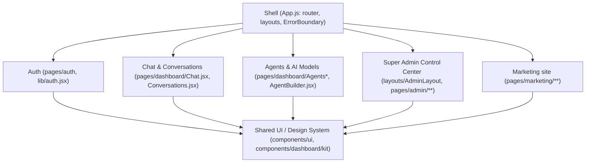

A **runtime** microfrontend split (Module Federation, separately deployed
bundles per team) would add real value once multiple teams need to ship
these surfaces independently with separate release trains. Today there is a
single frontend team and a single deploy target, so splitting now would add
build/runtime complexity without a corresponding ownership boundary to
justify it. See [Pages & Routes](PAGES_AND_ROUTES.md) for the full route
inventory, including several self-service surfaces (billing, team, API keys,
webhooks, analytics, settings) that are currently redirected to the
dashboard home rather than exposed in the nav.

### 2.3 Next.js

Next.js is **not used**. The marketing site is fully static, pre-rendered at
build time by CRA, and served from GitHub Pages with per-route SEO metadata
already injected via `src/lib/seo.js` (`useSEO` hook). Next.js would only be
justified for true per-request SSR/ISR (e.g. dynamic marketing pages
generated from a CMS) — it does not need that today.

### 2.4 Directory structure

```
frontend/src/
  pages/           # route-level components, grouped by bounded context
    marketing/      admin/       dashboard/     auth/        onboarding/
    demos/          legal/       public/
  components/      # shared design system + feature-scoped components
    ui/             dashboard/   marketing/     admin/       auth/
  layouts/         # MarketingLayout, DashboardLayout, OnboardingLayout, AdminLayout, AuthShell
  lib/             # api client, auth context, seo hook, entitlements
  hooks/  services/  constants/
```

### 2.5 GitHub Pages + client-side routing

GitHub Pages has no server-side rewrite rules, so a direct load of a
client-routed path (e.g. `oraone.in/products`) 404s by default. This is
solved with the standard SPA-on-GitHub-Pages redirect trick:

- `public/404.html` — GitHub Pages serves this for any unknown path; it
  round-trips the real path through a query string and redirects to `/`.
- `public/index.html` — a small inline script restores the real path via
  `history.replaceState` before React Router mounts.
- `public/CNAME` — pins the custom domain `oraone.in`.
- See §6.3 for the DNS/TLS chain.

---

## 3. Backend architecture

### 3.1 Request lifecycle (the diagram to look at when debugging a production request)

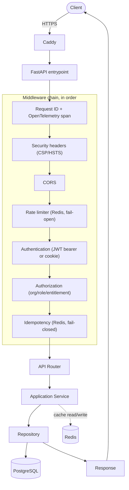

### 3.2 Why FastAPI only (not Express + FastAPI)

There is no Node.js/Express service in this codebase — the entire backend is
a single FastAPI application, serving as both API gateway/BFF (routing,
validation, CORS, rate limiting, security headers) and AI orchestration
(`app/services/agent_runtime.py`, `app/providers/*`, the RAG pipeline). One
well-tested service is simpler to operate, secure, and deploy than two.

### 3.3 Middleware chain (defense in depth)

| Layer | Responsibility |
|---|---|
| `CORSMiddleware` | Origin allow-list via `CORS_ORIGINS` env var (never `*` with credentials). |
| `security_headers_mw` | `X-Content-Type-Options`, `X-Frame-Options`, `Referrer-Policy`, `Permissions-Policy`, `Cross-Origin-Opener-Policy`, `Content-Security-Policy` (strict `default-src 'none'`, relaxed only for `/docs`/`/redoc`), `Strict-Transport-Security` over HTTPS. |
| `request_context_mw` | Generates/propagates `X-Request-Id`; emits one structured JSON access-log line per request (structlog) including `trace_id` when OpenTelemetry is enabled. Never logs headers, bodies, or secrets. |
| `rate_limit_mw` | Tiered, Redis-backed fixed-window limiter (`app/middleware/rate_limit.py`): `password` (5/15min), `auth` (10/min), `ai` (20/min), `api` (120/min). Keyed by JWT subject when authenticated, else client IP. **Fails open** on a Redis outage. |
| `idempotency_mw` | `Idempotency-Key` header support for mutating requests (`app/middleware/idempotency.py`) — replays the cached response on retry, returns 409 for a concurrent duplicate in flight. **Fails closed** (503) on a Redis outage. |
| `audit_flush_mw` | Persists buffered audit-log records after each request. |
| `api_v1_access_log_mw` | Per-API-key request logging for the public `/api/v1` surface (quota/usage attribution). |

### 3.4 Authentication & authorization — kept as distinct stages

Authentication answers *"who is this?"*; authorization answers *"what can
this user access?"*. A valid JWT is **never** treated as "request
authorized" — it only establishes identity, which then flows through a
separate, explicit authorization pipeline:

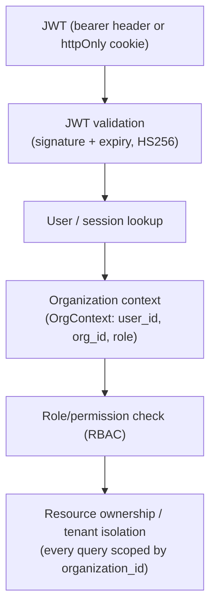

`app/services/authorization.py`'s `authorize()` pipeline evaluates, in
order: authentication → subscription status → product entitlement
(fail-closed; unknown products deny) → feature flag → permission (RBAC).
Every protected endpoint calls this **server-side**; frontend route guards
(`ProtectedRoute`/`GuestRoute`) are a UX convenience only, never a security
boundary.

#### Login — dual token delivery

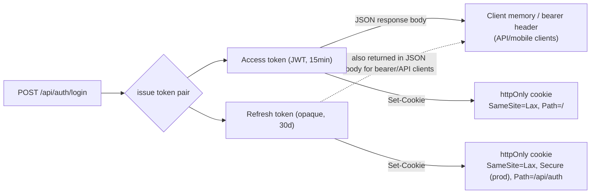

The access token is genuinely dual-delivered (JSON body **and** cookie) so
existing bearer-based frontend code keeps working unmodified. The refresh
token is *also* returned in the JSON body for non-browser clients, but a
browser session can — and by default does — rely on the httpOnly cookie
alone, so JS never needs to touch the long-lived, more sensitive token.

#### Refresh — rotation + reuse detection

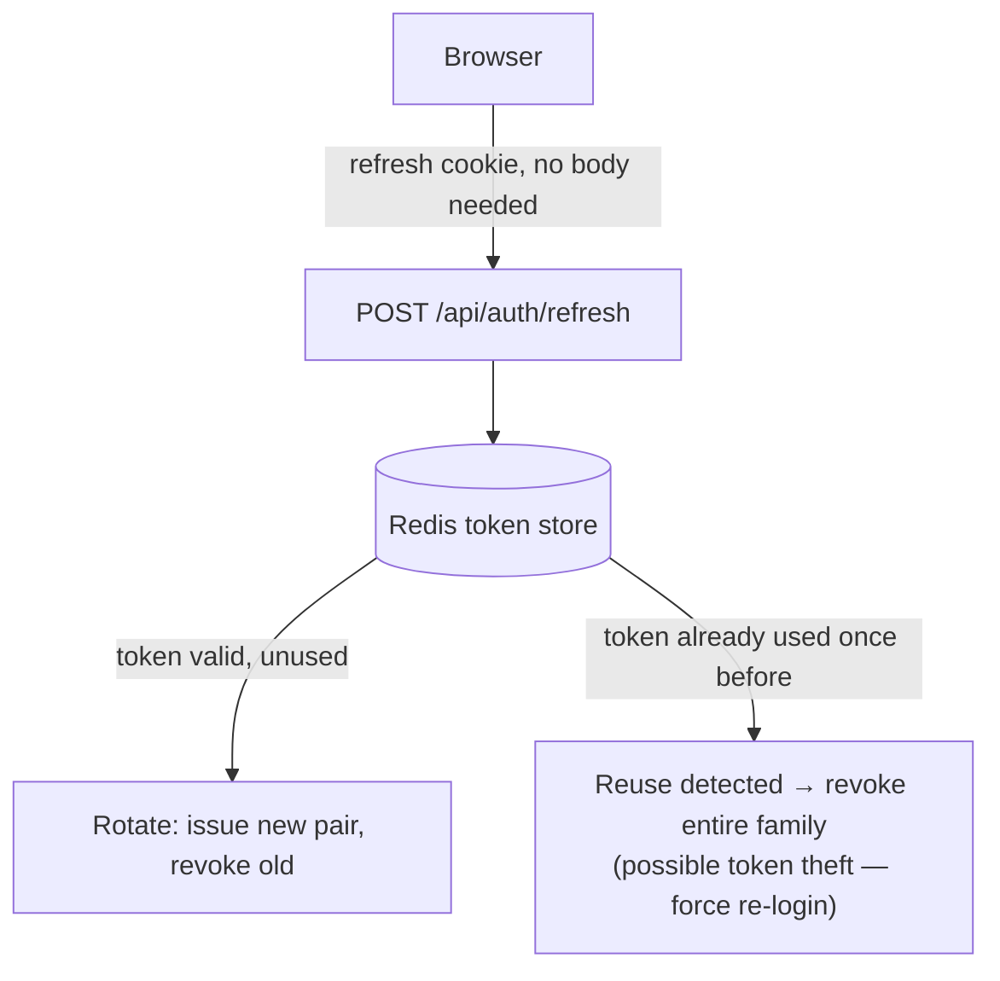

#### Logout

`POST /api/auth/logout` revokes the presented refresh token in Redis and
clears both cookies (`Max-Age=0`). `POST /api/auth/logout-all` revokes every
refresh token for the account (all devices/sessions).

### 3.5 Redis usage & failure semantics

Redis sits behind the `CacheBackend` abstraction (`app/services/cache.py`):
`InProcessCacheBackend` (default, single-node) or `RedisCacheBackend`
(namespaced keys, native TTL, pub/sub invalidation). Selection is env-driven
(`REDIS_URL`, `ENTITLEMENTS_CACHE_BACKEND`) and never crashes the app if
Redis is unavailable — **each consumer defines its own failure policy,
deliberately, not uniformly**:

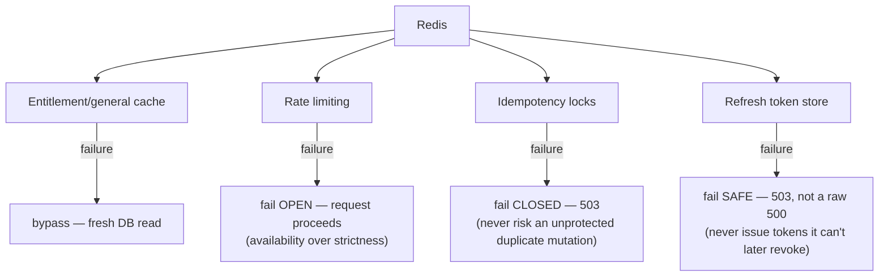

Not cached: conversation content, message bodies, anything containing PII —
only counters, entitlement booleans, and opaque token references.

### 3.6 Database

PostgreSQL via async SQLAlchemy + Alembic (`backend/alembic/versions/`),
organized into logical domains (not separate schemas/databases — a single
`oraone` database, separated by table naming/foreign keys):

```
PostgreSQL
├── Identity (users, password_hash, sessions)
├── Organizations / Memberships (multi-tenancy boundary)
├── Agents (chat/WhatsApp assistants, prompt versions)
├── Conversations / Messages (channel-tagged, cursor-paginated)
├── Knowledge / Documents (chunks + metadata; binaries live in MinIO)
├── Integrations (third-party connections, encrypted credentials)
├── Webhooks / Outbox (transactional outbox — see §3.8)
├── Analytics (events, daily rollups, cost reports)
└── pgvector (embeddings, cosine-similarity search)
```

Every business mutation and its corresponding outbox event (if any) commit
**in the same database transaction** — this is what makes the
transactional-outbox guarantee (§3.8) actually hold:

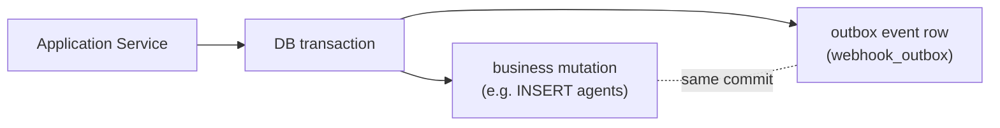

Notable migrations: `0044_self_hosted_auth` (password hash + email
verification columns, backfills the local admin account),
`0045_webhook_outbox` (transactional outbox table),
`0046_contact_forms` (contact/newsletter tables, replacing MongoDB).

### 3.7 Object storage — Postgres holds metadata, MinIO holds bytes

Postgres and MinIO are **not interchangeable databases** — they store
fundamentally different things:

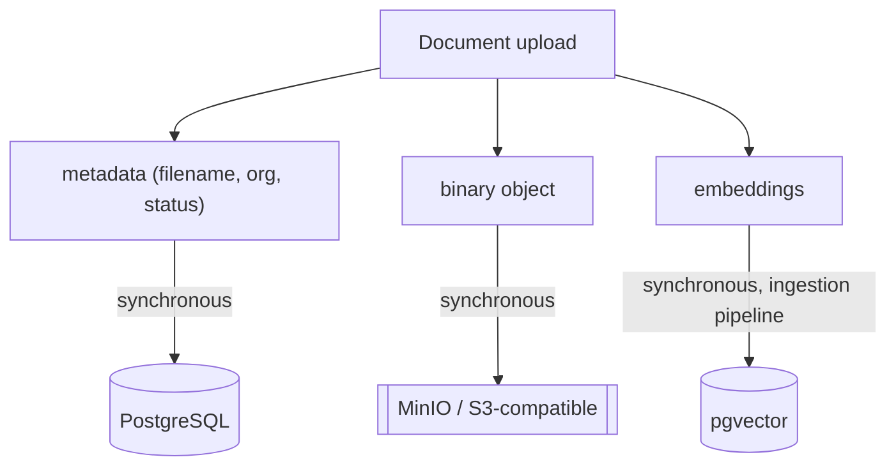

`app/services/storage.py` is S3-compatible when `S3_BUCKET`/`S3_ENDPOINT_URL`
are set (real AWS S3, MinIO, Cloudflare R2, Backblaze B2 — auto-creates the
bucket on first use for non-AWS endpoints), otherwise falls back to local
disk under `UPLOAD_DIR`.

### 3.8 Transactional outbox (webhooks) — at-least-once delivery

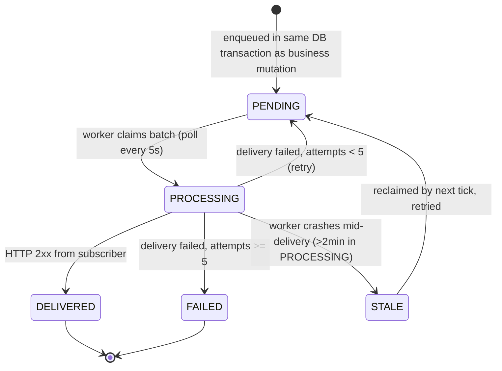

Key columns: `event_id` (stable id for consumer-side dedup), `attempts`,
`last_error`, `processed_at`. This is explicitly **at-least-once delivery,
not exactly-once** — a worker crash between "subscriber received it" and
"marked DELIVERED" can redeliver the same event. **Webhook consumers must be
idempotent on `event_id`.**

### 3.9 AI provider fallback chain

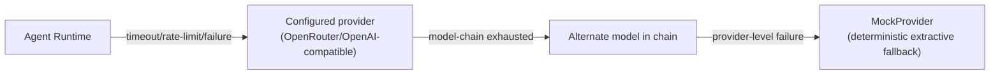

⚠️ **This is a production-visible fallback, not just a dev convenience**: if
every configured AI model/provider is unavailable, the chat turn still
returns a response — from `MockProvider` — rather than a 500. End users can
receive a deterministic, non-AI-generated answer in production during a
provider outage. This is an intentional availability tradeoff (never hard-fail
a chat turn), not a claim that mock responses are AI-quality.

### 3.10 Storage & email portability (no cloud lock-in)

- **Email** (`app/services/email_service.py`): sends via SES when
  `EMAIL_FROM` + AWS credentials are present, otherwise logs the rendered
  email and returns `False` — callers never crash because email isn't
  configured.
- **AI embeddings**: pluggable provider layer (`app/providers/*`), defaults
  to OpenRouter/OpenAI-compatible APIs; AWS Bedrock is one optional
  embeddings provider among several, not a hard dependency.

---

## 4. Chat system architecture

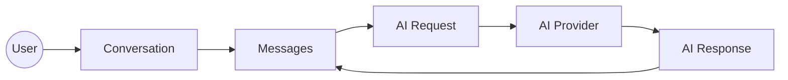

- **Conversations** are channel-tagged (`chat`, `whatsapp`, `sms`, `email`,
  `messenger`, `instagram`, `telegram`, `slack`).
- **Pagination**: conversation lists and message history use cursor/offset
  pagination rather than loading full history — see `app/api/chat/routes.py`.
- **Identity**: `VisitorProfile` links the same person across channels
  (e.g. website chat + WhatsApp) via phone/email aliasing.
- **Resilience**: see §3.9 for the AI provider fallback chain.
- **Synchronous vs asynchronous**: the chat request/response round-trip is
  synchronous end-to-end (user waits for the AI reply). Webhook delivery
  (§3.8) and workflow-scheduler triggers are asynchronous — the triggering
  request returns immediately and the side effect happens later via a
  background worker.

---

## 5. Security posture

| Control | Status |
|---|---|
| Security headers (CSP, HSTS, X-Frame-Options, nosniff, Permissions-Policy, COOP) | ✅ `security_headers_mw` |
| CORS allow-list | ✅ env-driven (`CORS_ORIGINS`), never `*` with credentials |
| Tiered rate limiting (password/auth/ai/api) | ✅ Redis-backed, fails open |
| Idempotency on mutating requests | ✅ Redis-backed, fails closed |
| httpOnly/SameSite auth cookies | ✅ defense-in-depth alongside bearer JWT |
| Input validation | ✅ Pydantic schemas on every request body |
| AuthZ fail-closed | ✅ unknown product/feature/permission → deny |
| Structured logging, no secrets in logs | ✅ structlog JSON, no headers/bodies |
| Secret management | ✅ env vars only; `.gitignore` covers `.env`, `*.pem` |
| Dependency vulnerability scanning | ✅ `pip-audit` run manually each release; not yet a CI gate (recommended next step) |
| HTTPS everywhere | ✅ GitHub Pages cert (Let's Encrypt) for the frontend; Caddy auto-HTTPS for self-hosted deployments |
| Disaster recovery | ✅ `backend/scripts/backup_restore_drill.py` — re-runnable pg_dump/restore/verify drill |

---

## 6. Deployment — two distinct topologies

**These are two separate deployment models, not one diagram.** A reader must
be able to tell at a glance which one is actually serving production traffic
today.

### 6.1 Current hosted model (production today)

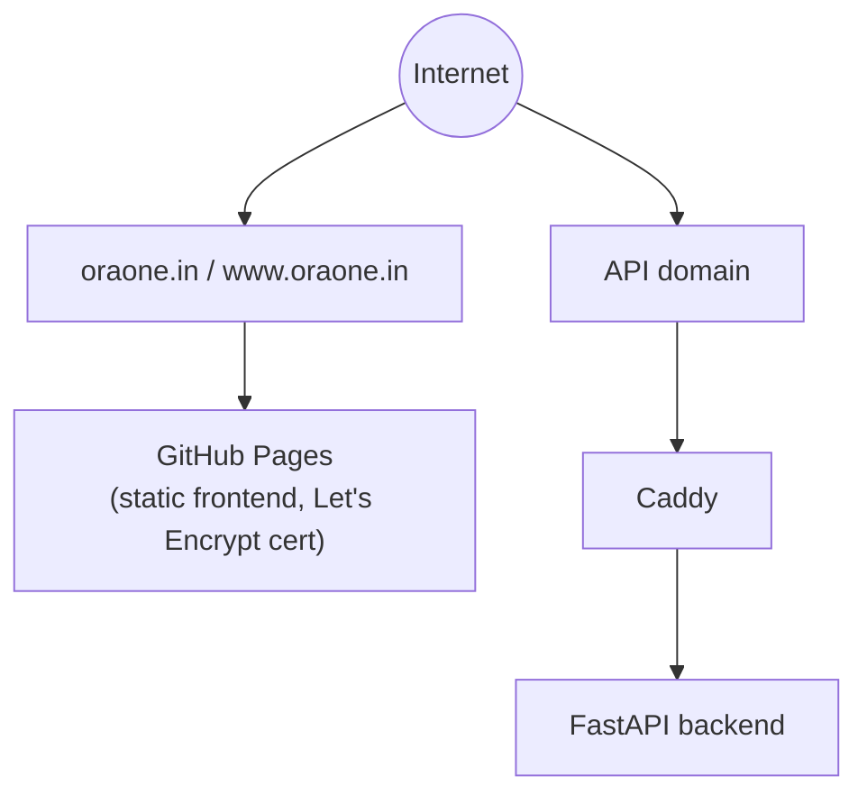

### 6.2 Self-hosted model (`docker-compose.prod.yml`, alternative)

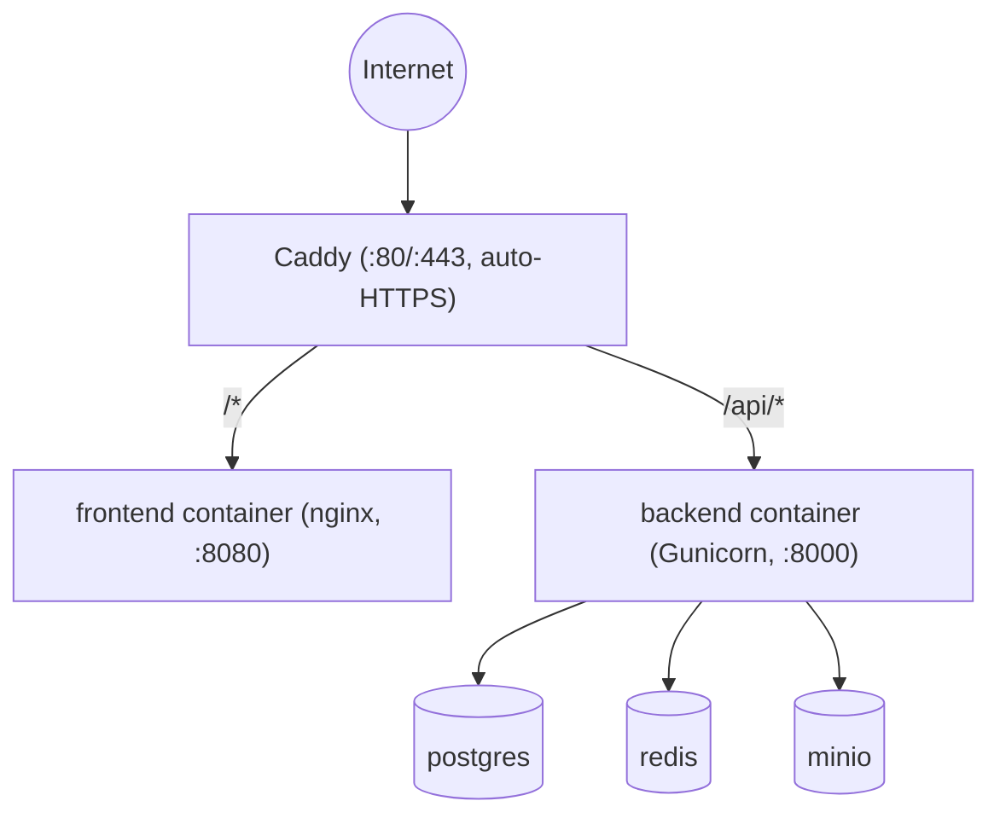

### 6.3 DNS / TLS chain (hosted model)

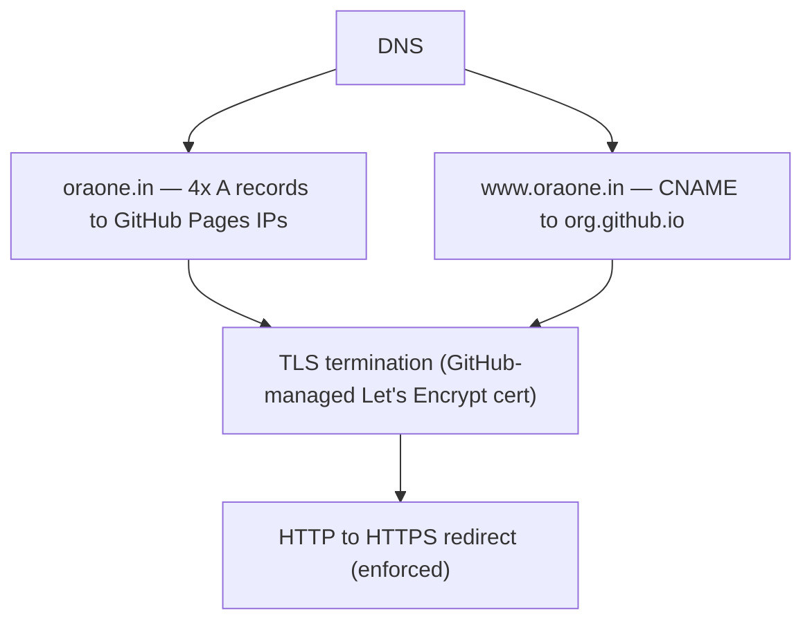

### 6.4 CI vs deploy — deliberately separate pipelines

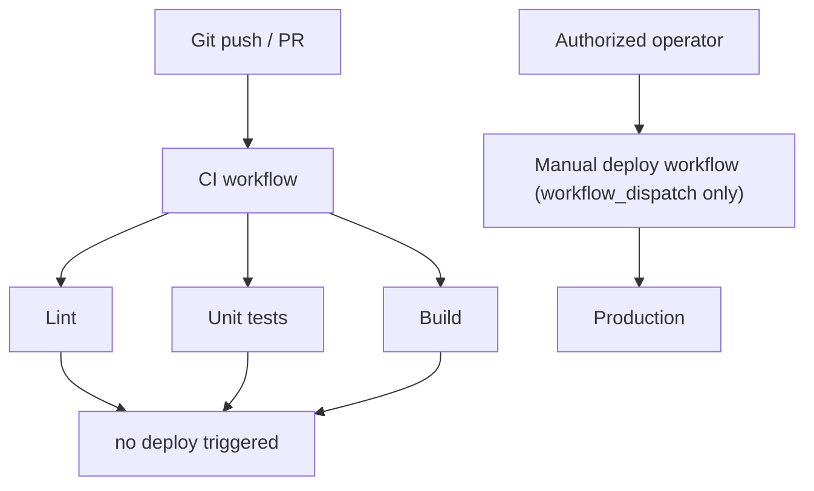

A compromised or malicious PR cannot automatically deploy to production —
`.github/workflows/ci.yml` (lint/build/test) and the deploy workflow are
fully decoupled, and the deploy workflow only runs on manual dispatch by an
authorized operator.

- **Frontend**: `.github/workflows/pages.yml` builds the CRA app and deploys
  it to GitHub Pages on every push to `main` that touches `frontend/**`.
- **Backend containerization**: `backend/Dockerfile` (multi-stage, non-root
  user) runs `alembic upgrade head` then Gunicorn (`gunicorn.conf.py` —
  `2*cpu+1` Uvicorn workers, capped at 8, periodic worker recycling).
- **Environment separation**: frontend only ever sees `REACT_APP_*` (public)
  variables; all secrets stay server-side in `backend/.env`, never bundled
  into the static frontend build or the backend image.
  `backend/.env.example` and `frontend/.env.example` are the committed,
  secret-free templates.

---

## 7. Observability & failure handling

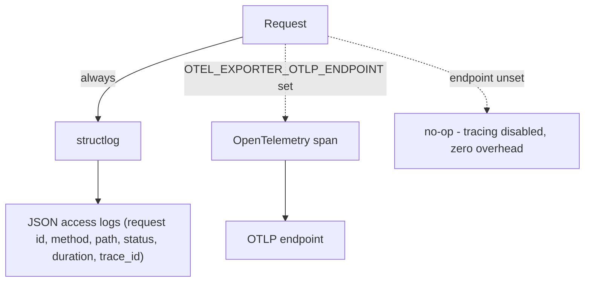

- Every HTTP response carries `X-Request-Id` for cross-log correlation.
- Audit log (`app.services.audit`) records privileged actions
  (create/update/delete on sensitive resources) separately from request
  access logs.
- Graceful degradation is the default posture: Redis down → per-primitive
  policy (§3.5); AI provider unset/exhausted → mock/extractive response
  (§3.9, production-visible); S3 unset → local disk; email unset → log-only.
  Background workers (workflow scheduler, webhook outbox) are cancelled
  cleanly on shutdown rather than killed mid-task.
- Disaster recovery is proven, not assumed:
  `backend/scripts/backup_restore_drill.py` dumps the live DB, restores into
  a throwaway database, and verifies row counts — safe to run on a schedule
  or before a deploy.

---

## 8. Scalability

- FastAPI is stateless per-request (no in-memory session affinity required)
  except for the in-process cache fallback, which is why the Redis backend
  exists for true multi-node deployments.
- Database indexes are aligned to the actual query patterns (organization
  scoping, status filters, timestamp range scans) rather than added
  speculatively — see `app/database/models/*.py` `__table_args__`.
- The frontend is a static bundle behind GitHub Pages' CDN (or Caddy's, for
  self-hosted deployments) — it scales independently of the backend by
  construction.

---

## 9. Deferred by design

These are **intentionally** not part of the current architecture — their
absence is a scoping decision, not architectural debt, and each has a
concrete trigger condition for revisiting:

| Deferred | Revisit when |
|---|---|
| CQRS | Read and write query patterns/load diverge enough that one model can't serve both efficiently. |
| Microservice decomposition | Multiple teams need independent release trains for different bounded contexts. |
| External API versioning (`/api/v2` for internal dashboard routes) | A breaking change to internal routes is unavoidable and can't be made additive. |
| Kafka / dedicated event bus | Webhook/outbox throughput or consumer count outgrows a single Postgres-backed queue. |
| Full frontend feature-based restructure (all domains) | Ongoing — only the `agents` domain is fully migrated to React Query today; see `docs/ARCHITECTURE_BASELINE.md`. |
| Vite migration | A CI environment can run the full authenticated route matrix and a dedicated migration window exists. |
| Kubernetes | Traffic/ops complexity outgrows a single Docker Compose host or a handful of container instances. |

If `docs/ARCHITECTURE.md` and [Pages & Routes](PAGES_AND_ROUTES.md) answer,
for any given engineer new to the codebase: where a request enters, where
auth/authorization happen, where data lives, which operations are async,
what happens when Redis/a webhook worker/an AI provider fails, how
production is deployed and recovered, and what's deliberately out of scope —
this document is doing its job.
