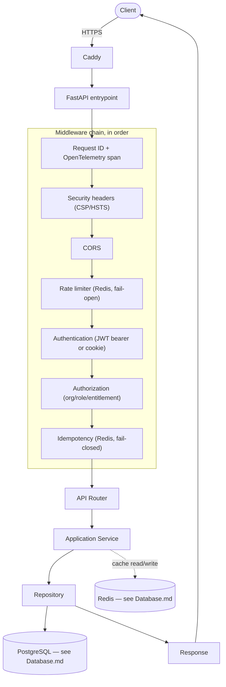
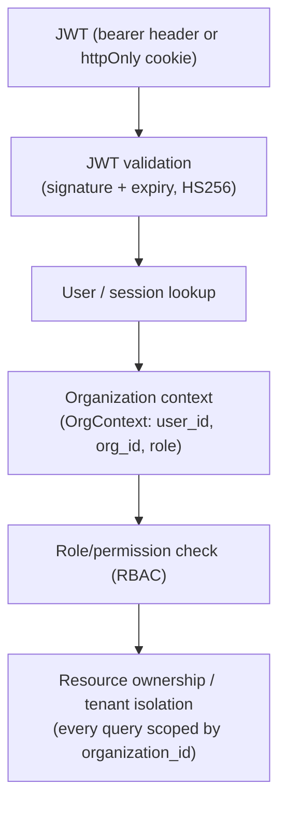
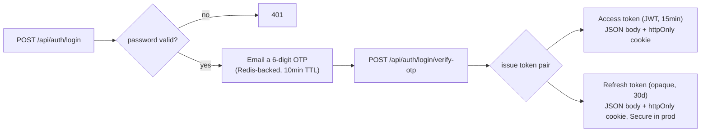
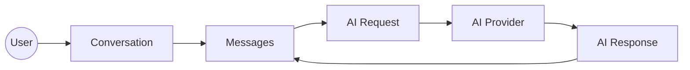
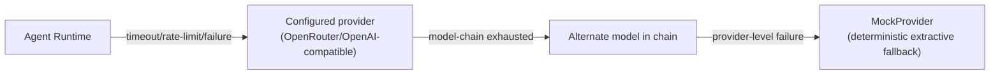
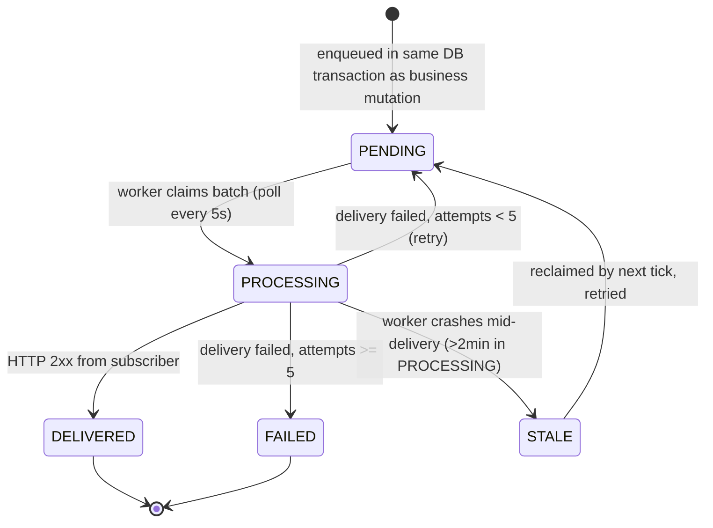

# OraOne — Backend

FastAPI (`backend/server.py`) — one service acting as both the dashboard
API/BFF and AI orchestration layer (`app/services/agent_runtime.py`,
`app/providers/*`, the RAG pipeline). No separate Node/Express service.

## Request lifecycle



## Middleware chain (defense in depth)

| Layer | Responsibility |
|---|---|
| `CORSMiddleware` | Origin allow-list via `CORS_ORIGINS` env var (never `*` with credentials). |
| `security_headers_mw` | `X-Content-Type-Options`, `X-Frame-Options`, `Referrer-Policy`, `Permissions-Policy`, `Cross-Origin-Opener-Policy`, `Content-Security-Policy` (strict `default-src 'none'`, relaxed only for `/docs`/`/redoc`), `Strict-Transport-Security` over HTTPS. |
| `request_context_mw` | Generates/propagates `X-Request-Id`; emits one structured JSON access-log line per request (structlog), including `trace_id` when OpenTelemetry is enabled. Never logs headers, bodies, or secrets. |
| `rate_limit_mw` | Tiered, Redis-backed fixed-window limiter (`app/middleware/rate_limit.py`): `password` (5/15min), `auth` (10/min), `ai` (20/min), `api` (120/min). Keyed by JWT subject when authenticated, else client IP. **Fails open** on a Redis outage. |
| `idempotency_mw` | `Idempotency-Key` header support for mutating requests (`app/middleware/idempotency.py`) — replays the cached response on retry, returns 409 for a concurrent duplicate in flight. **Fails closed** (503) on a Redis outage. |
| `audit_flush_mw` | Persists buffered audit-log records after each request. |
| `api_v1_access_log_mw` | Per-API-key request logging for the public `/api/v1` surface (quota/usage attribution). |

## Authentication & authorization — distinct stages

Authentication answers *"who is this?"*; authorization answers *"what can
this user access?"*. A valid JWT is **never** treated as "request
authorized" — it flows through a separate, explicit authorization pipeline:



`app/services/authorization.py`'s `authorize()` pipeline evaluates, in
order: authentication → subscription status → product entitlement
(fail-closed; unknown products deny) → feature flag → permission (RBAC).
Every protected endpoint calls this **server-side**; frontend route guards
are a UX convenience only, never a security boundary.

Auth itself is fully **self-hosted** — Argon2 password hashing + JWT
access/refresh tokens (`app/services/auth_service.py`,
`app/core/security.py`) plus an **email OTP second factor on login** — no
external identity provider.



Refresh rotates on every use and detects reuse (a second use of an already-
rotated token revokes the entire token family — possible theft, forces
re-login). `POST /api/auth/logout` revokes the presented refresh token;
`POST /api/auth/logout-all` revokes every token for the account.

## Chat system



- **Conversations** are channel-tagged (`chat`, `whatsapp`, `sms`, `email`,
  `messenger`, `instagram`, `telegram`, `slack`, `teams`, `mobile`, `desktop`).
- Conversation lists and message history use cursor/offset pagination
  (`app/api/chat/routes.py`), not full-history loads.
- `VisitorProfile` links the same person across channels (e.g. website chat
  + WhatsApp) via phone/email aliasing.
- The chat request/response round-trip is synchronous end-to-end (user
  waits for the AI reply). Webhook delivery and workflow-scheduler triggers
  are asynchronous — the triggering request returns immediately.

### AI provider fallback chain



⚠️ **Production-visible fallback, not just a dev convenience**: if every
configured AI model/provider is unavailable, the chat turn still returns a
response — from `MockProvider` — rather than a 500. This is an intentional
availability tradeoff (never hard-fail a chat turn), not a claim that mock
responses are AI-quality.

## Transactional outbox (webhooks) — at-least-once delivery



Key columns: `event_id` (stable id for consumer-side dedup), `attempts`,
`last_error`, `processed_at`. Explicitly **at-least-once, not exactly-once**
— a worker crash between "subscriber received it" and "marked DELIVERED"
can redeliver the same event. **Webhook consumers must be idempotent on
`event_id`.**

## Portability (no cloud lock-in)

- **Email** (`app/services/email_service.py`): sends via SES when
  `EMAIL_FROM` + AWS credentials are present, otherwise logs the rendered
  email and returns `False` — callers never crash because email isn't
  configured.
- **Object storage** (`app/services/storage.py`): S3-compatible when
  `S3_BUCKET`/`S3_ENDPOINT_URL` are set (real AWS S3, MinIO, Cloudflare R2,
  Backblaze B2), otherwise local disk under `UPLOAD_DIR`.
- **Embeddings**: pluggable provider layer (`app/providers/*`); AWS Bedrock
  is one optional embeddings provider among several, not a hard dependency.

## Public API

The public REST API (`/api/v1`) lets external developers manage agents,
chat, knowledge, search, workflows and usage programmatically — separate
from the dashboard API (JWT + `X-Project-Id`) and the public **widget** API
(`/api/widget/*`, authenticated with a widget key).

- **Base URL (production):** `https://api.oraone.in/v1`
- **Auth:** API key as a Bearer token — `Authorization: Bearer sk_ora_xxxxxxxx`.
  Create/scope keys in **Developers** (`/app/developers`). Scopes include
  `chat:read`, `chat:write`, `agents:read`, `knowledge:read`,
  `documents:read`, `websites:read`, `search:read`, `widgets:read`,
  `widgets:manage`, `integrations:read`, `integrations:manage`,
  `workflows:read`, `workflows:execute`, `analytics:read`, `usage:read`,
  `webhooks:manage`. Missing scope → `403`.
- **Rate limit:** per-key `api_rpm` (see [Features → Plans & limits](FEATURES.md#plans--limits)); exceeded → `429`.
- **OpenAPI schema:** `GET /openapi.json`.

| Status | Meaning |
|--------|---------|
| `400` | Malformed request. |
| `401` | Missing or invalid API key. |
| `403` | Key lacks the required scope. |
| `402` | Plan quota exceeded. |
| `404` | Resource not found. |
| `429` | Rate limit exceeded. |
| `5xx` | Server / upstream provider error. |

| Area | Method | Path | Scope |
|---|---|---|---|
| Health | `GET` | `/ping` | — |
| Agents | `GET` | `/agents` | `agents:read` |
| Chat | `POST` | `/chat` | `chat:write` |
| Conversations | `GET` | `/conversations`, `/conversations/{id}` | `chat:read` |
| Knowledge | `GET` | `/knowledge-bases`, `/documents`, `/websites` | `knowledge:read` / `documents:read` / `websites:read` |

```bash
curl -X POST https://api.oraone.in/v1/chat \
  -H "Authorization: Bearer $ORAONE_API_KEY" \
  -H "Content-Type: application/json" \
  -d '{ "agent_id": "<id>", "message": "What plans do you offer?" }'
```
