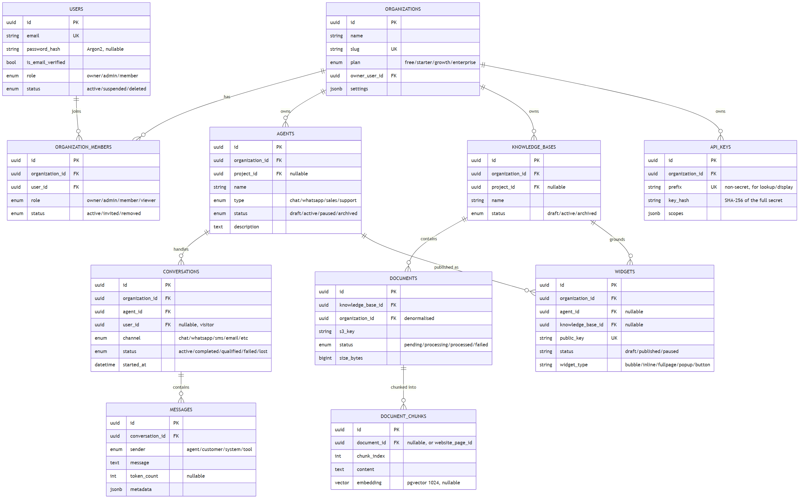
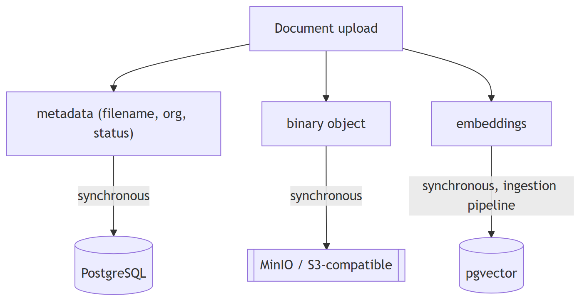
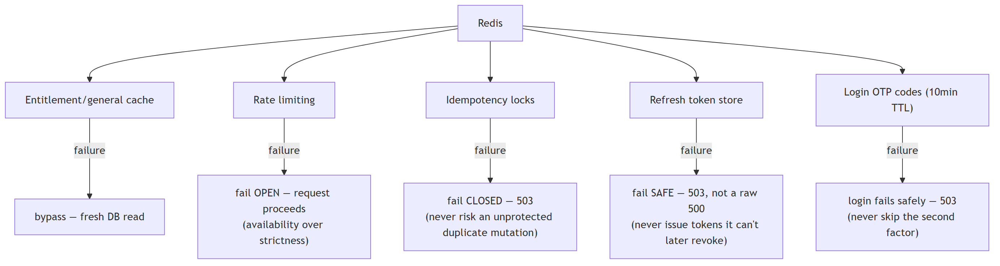

# OraOne — Database & Cache

PostgreSQL (async SQLAlchemy + Alembic, `backend/alembic/versions/`) is the
single system of record — one `oraone` database, ~45 tables separated by
naming/foreign keys (not separate schemas). Redis is optional, additive
state (idempotency, rate limiting, refresh tokens, entitlement cache) — the
app never crashes if it's unavailable.

## Domains

```
PostgreSQL
├── Identity (users, password_hash, sessions)
├── Organizations / Memberships (multi-tenancy boundary)
├── Agents (chat/WhatsApp assistants, prompt versions)
├── Conversations / Messages (channel-tagged, cursor-paginated)
├── Knowledge / Documents (chunks + metadata; binaries live in MinIO/S3)
├── Widgets (embeddable chat, public keys, domains, sessions)
├── Integrations (third-party connections, encrypted credentials)
├── Webhooks / Outbox (transactional outbox — see Backend.md)
├── Analytics (events, daily rollups, cost reports)
└── pgvector (embeddings, cosine-similarity search)
```

## Core entities (fields)



All tables carry `id` (UUID PK), `created_at`/`updated_at`, and most also
`deleted_at` (soft delete — `SoftDeleteMixin`). Every tenant-scoped table
indexes `organization_id`; document/message tables add a composite index
on `(parent_id, created_at)` for cursor pagination.

## Object storage — Postgres holds metadata, MinIO/S3 holds bytes



`app/services/storage.py` is S3-compatible when `S3_BUCKET`/`S3_ENDPOINT_URL`
are set (real AWS S3, MinIO, Cloudflare R2, Backblaze B2 — auto-creates the
bucket on first use for non-AWS endpoints), otherwise falls back to local
disk under `UPLOAD_DIR`.

Every business mutation and its corresponding outbox event (if any) commit
**in the same database transaction** — this is what makes the
transactional-outbox guarantee (see [Backend](BACKEND.md#transactional-outbox-webhooks--at-least-once-delivery)) actually hold.

Notable migrations: `0044_self_hosted_auth` (password hash + email
verification columns, backfills the local admin account),
`0045_webhook_outbox` (transactional outbox table), `0046_contact_forms`
(contact/newsletter tables).

## Redis — usage & failure semantics

Redis sits behind a `CacheBackend` abstraction (`app/services/cache.py`):
`InProcessCacheBackend` (default, single-node) or `RedisCacheBackend`
(namespaced keys, native TTL, pub/sub invalidation). Selection is env-driven
(`REDIS_URL`, `ENTITLEMENTS_CACHE_BACKEND`) and **each consumer defines its
own failure policy, deliberately, not uniformly**:



Not cached: conversation content, message bodies, anything containing PII —
only counters, entitlement booleans, and opaque token/OTP references.
