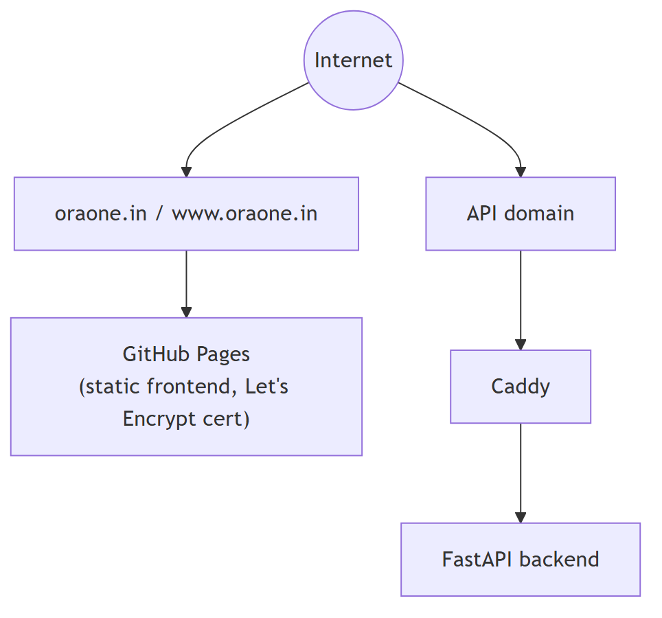
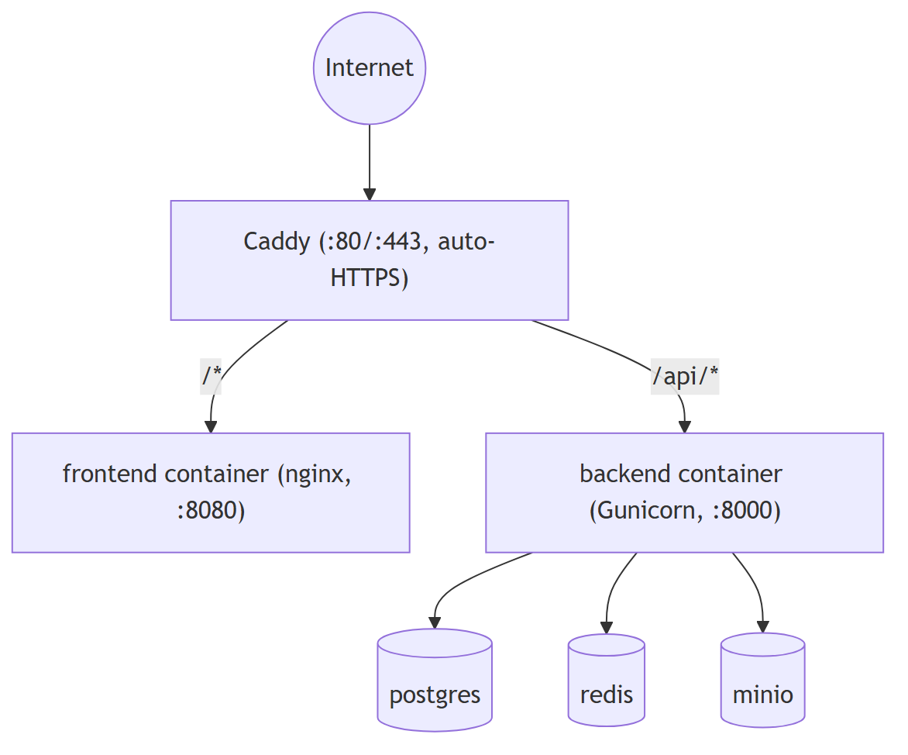
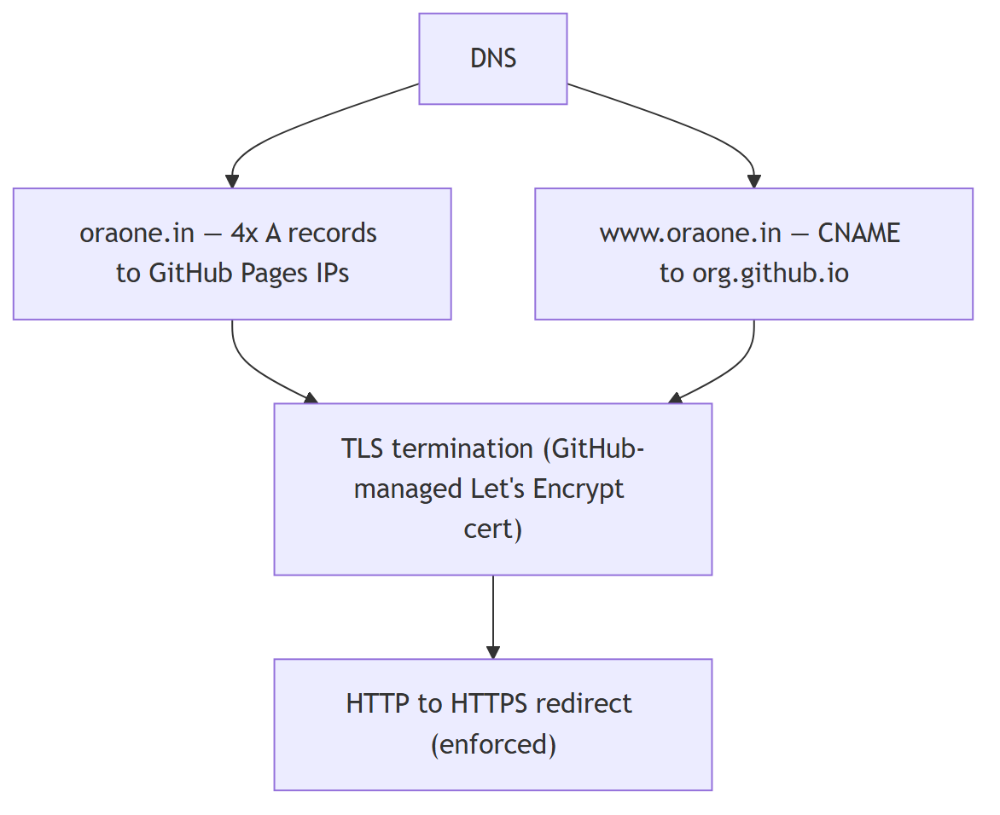
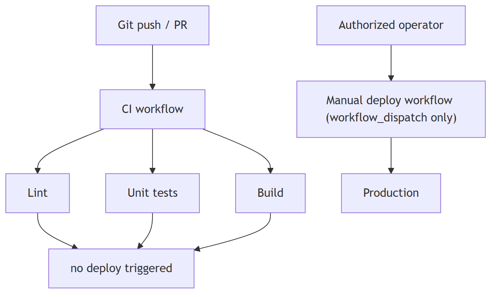
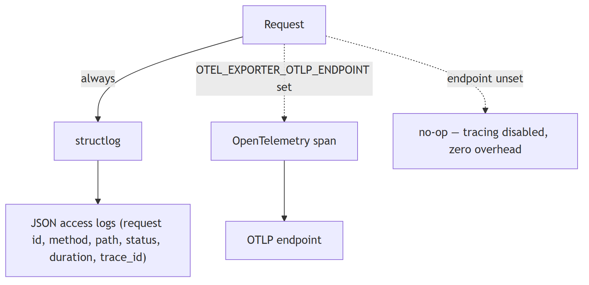

# OraOne — Deployment & Operations

Two distinct topologies exist. A reader must be able to tell at a glance
which one is actually serving production traffic today.

## Current hosted model (production today)



- **Frontend**: `.github/workflows/pages.yml` builds the CRA app and
  deploys to GitHub Pages on every push to `main` that touches
  `frontend/**`.
- **Backend**: `backend/Dockerfile` (multi-stage, non-root user) runs
  `alembic upgrade head` then Gunicorn (`gunicorn.conf.py` — `2*cpu+1`
  Uvicorn workers, capped at 8, periodic worker recycling).

## Self-hosted model (`docker-compose.prod.yml`, alternative)



Any container platform (Fly.io, Render, Railway, ECS/Cloud Run, a K8s
cluster) or a single VPS/dedicated server with Docker works — push the
images to a registry (or `docker compose -f docker-compose.prod.yml up -d
--build` directly on a VPS) with the env vars from
`backend/.env.example` / `frontend/.env.example`. The backend needs a
reachable Postgres (with `pgvector`) and, optionally, Redis; the frontend
only needs `REACT_APP_API_URL` set at **build** time (static bundle, baked
in, not read at runtime). Put nginx/Caddy/Traefik in front for TLS. See
[Local Setup](../LOCAL_SETUP.md) for the bare-metal-without-Docker path.

In every case: set `ENVIRONMENT=production`, a real `CORS_ORIGINS` (never
`*`), and a real `JWT_SECRET_KEY` (self-hosted auth is always active — no
external identity provider to configure).

## DNS / TLS chain



## CI vs deploy — deliberately separate pipelines



A compromised or malicious PR cannot automatically deploy to production —
`.github/workflows/ci.yml` (lint/build/test) and the deploy workflow are
fully decoupled; deploy only runs on manual dispatch by an authorized
operator. Frontend only ever sees `REACT_APP_*` (public) variables; all
secrets stay server-side in `backend/.env`, never bundled into the static
frontend build or the backend image.

## Health checks & status

| Endpoint | Returns | Use |
|----------|---------|-----|
| `GET /api/health` | `200` always when the app is up | Liveness / load-balancer target. |
| `GET /api/health/ready` | `200` healthy, degraded detail if DB/Redis unreachable | Readiness / dependency connectivity. |

The in-app **Status** page (`/app/status`) polls both every 30s and renders
an overall banner plus per-component health with latencies.

```powershell
(Invoke-WebRequest -Uri "https://<host>/api/health" -UseBasicParsing).StatusCode
(Invoke-WebRequest -Uri "https://<host>/api/health/ready" -UseBasicParsing).StatusCode
```

## Observability



Every HTTP response carries `X-Request-Id` for cross-log correlation. The
audit log (`app.services.audit`) records privileged actions
(create/update/delete on sensitive resources) separately from request
access logs. Graceful degradation is the default posture: Redis down →
per-primitive policy (see [Database → Redis](DATABASE.md#redis--usage--failure-semantics));
AI provider unset/exhausted → mock/extractive response, production-visible
(see [Backend](BACKEND.md#ai-provider-fallback-chain)); S3 unset → local
disk; email unset → log-only. Background workers (workflow scheduler,
webhook outbox) are cancelled cleanly on shutdown rather than killed
mid-task.

## Common incidents

| Symptom | Likely cause | Action |
|---------|-------------|--------|
| App returns 500s on startup | Missing **Required** env var | Check logs for `Missing required environment variable`; set it (see [Environment](ENVIRONMENT.md)). |
| `GET /api/health/ready` degraded | DB down / bad `DATABASE_URL`, or Redis unreachable | Restore connectivity; verify credentials and host/port. |
| Chat returns `502` | Invalid/expired AI provider key | Rotate `OPENAI_API_KEY`; until fixed, the widget path degrades to extractive answers, the dashboard chat path surfaces the error. |
| Customers hit `402` | Plan resource/AI-message quota | Confirm against [Features → Plans & limits](FEATURES.md#plans--limits); prompt upgrade. |
| Customers hit `429` | API rate limit (`api_rpm`) | Expected throttling; advise backoff or a higher tier. |
| Widget not loading | Wrong `WIDGET_CDN_BASE` / `CORS_ORIGINS` | Verify public URLs and allowed origins. |
| Document upload 500s locally | `S3_BUCKET` set without `S3_ENDPOINT_URL` — tries real AWS with no creds | Set `S3_ENDPOINT_URL` to your MinIO endpoint (see [Local Setup](../LOCAL_SETUP.md)), or unset `S3_BUCKET` to use local-disk fallback. |

**Deploying changes**: the server runs **without** `--reload` in
production — restart the service after any backend edit. Database changes
require `cd backend && python -m alembic upgrade head`. Bump
`ORAONE_VERSION` per release so status/ops endpoints report it.

## Backups & disaster recovery

- **Database**: use your host's automated backups (managed Postgres
  snapshots, or `pg_dump` on a cron for self-hosted) with point-in-time
  recovery where available.
- **Prove restores work — don't just trust the backup job.** Run
  `python backend/scripts/backup_restore_drill.py` periodically (cron/CI):
  it `pg_dump`s the live DB, restores into a throwaway `_restore_drill`
  database, compares row counts on core tables, then drops the throwaway
  DB. Exits non-zero on any mismatch so it can gate a deploy or page
  on-call. Verified locally: dump → restore → row counts for
  `users`/`agents`/`conversations`/`organizations` matched exactly,
  pgvector extension and `alembic_version` both intact in the restore.
- **Object storage**: enable versioning on the uploads bucket/volume so
  documents can be recovered.
- **Secrets**: store `JWT_SECRET_KEY`, `INTEGRATIONS_ENCRYPTION_KEY`,
  provider and Stripe keys in a secrets manager — never in source control.
  Rotating `INTEGRATIONS_ENCRYPTION_KEY` invalidates stored integration
  credentials, which must then be re-connected.

## Scaling notes

- The backend is stateless apart from the database and object storage —
  scale horizontally behind a load balancer using `GET /api/health` as the
  target.
- Postgres is the primary bottleneck; scale vertically and add read
  capacity as needed. pgvector similarity search benefits from appropriate
  indexes (see [Database](DATABASE.md)).
- API throughput is naturally bounded per key by `api_rpm`; raise customer
  tiers rather than removing limits.
- Database indexes are aligned to actual query patterns (organization
  scoping, status filters, timestamp range scans), not added speculatively.
- The frontend is a static bundle behind GitHub Pages' CDN (or Caddy's, for
  self-hosted deployments) — scales independently of the backend.

## Pre-launch checklist

- [ ] Set a **valid AI provider key** (`OPENAI_API_KEY`) so dashboard chat
      generates (not just extractive); the widget already degrades
      gracefully without one.
- [ ] Restrict `CORS_ORIGINS` to production domains (never `*`).
- [ ] Set a strong, unique `JWT_SECRET_KEY` and `INTEGRATIONS_ENCRYPTION_KEY`.
- [ ] Terminate TLS at the proxy (Caddy does this automatically) and
      confirm `Strict-Transport-Security` is present on responses.
- [ ] Configure `EMAIL_FROM` + a verified sender to enable transactional
      email (OTP codes, verification, password reset).
