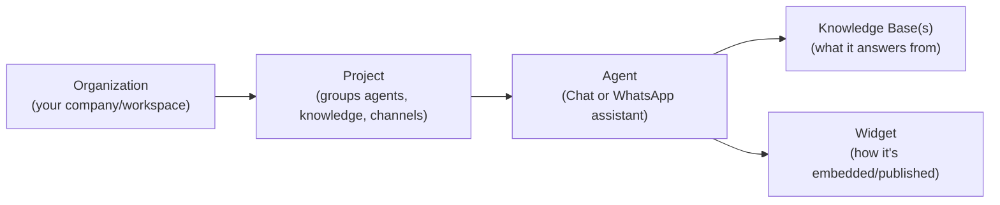
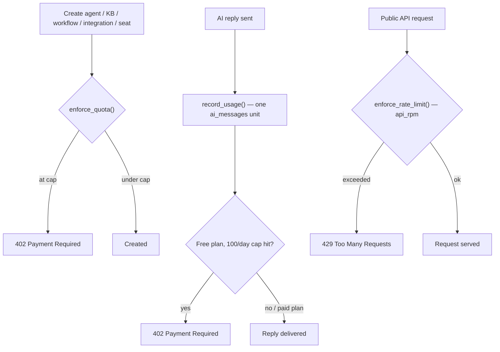

# OraOne — Features

## What makes OraOne, OraOne

OraOne's product is the intersection of three capabilities, not any one of
them alone: LLM-powered **AI Conversations**, **Omnichannel Delivery**
(web widget + WhatsApp behind one agent), and **Knowledge Grounding (RAG)**
(citing your own documents/websites instead of hallucinating). Regenerate
the diagram from `scripts/diagram/feature-venn.html` if the pillars change.

## Key features

| | |
|---|---|
| 🤖 **Multi-channel AI agents** | One knowledge base, deployed to both website chat and WhatsApp with consistent tone and context. |
| 📚 **RAG knowledge base** | Upload PDFs/FAQs/docs — chunked and embedded (pgvector), retrieved with scored citations at answer time. |
| 💬 **Embeddable chat widget** | A single `<script>` tag; works with React, Next.js, WordPress, Shopify and plain HTML. |
| 🎯 **Lead qualification & capture** | Configurable qualification frameworks, auto-scoring, and CRM handoff via native integrations or webhooks. |
| 🔐 **Self-hosted authentication** | Argon2 password hashing + JWT access/refresh tokens + email OTP second factor — no third-party identity provider. |
| 📊 **Analytics & reporting** | Conversation, conversion, and channel-level dashboards. |
| 🛠️ **Public REST API** | A versioned `/api/v1` surface for developers to build on top of OraOne — see [Backend](BACKEND.md#public-api). |
| 🧑‍💼 **Super Admin Control Center** | Org/tenant management, entitlements, security, and platform operations tooling. |
| 🌐 **90+ languages** | Auto-detects visitor language and replies natively. |
| 🔒 **Security-first** | Tiered rate limiting, idempotency, CSP/HSTS security headers, audit logging, RBAC. |

## How the product is organized

OraOne is structured as **Organization → Project → Agent**:

- Every user belongs to an **organization**; the active **project** is sent
  to the API via the `X-Project-Id` header.
- An **agent** is an AI assistant for a channel (Chat or WhatsApp), backed
  by one or more knowledge bases. Manage in **Agents** (`/app/agents`).
- A **knowledge base** is the source of truth an agent answers from —
  upload PDFs/FAQs/docs; OraOne chunks and embeds them (pgvector) and
  retrieves the most relevant passages at answer time, with scored
  citations. If no AI provider is configured, the agent still answers using
  grounded extractive snippets. Manage in **Knowledge** (`/app/knowledge`).
- A **widget** publishes an agent as an embeddable chat experience — a
  single JS snippet, served from `/api/widget/*`, identified by a public
  key. Visitors get sessions, messages, lead capture, escalation, and
  👍/👎 feedback (`POST /api/widget/feedback`) so answer quality can be
  measured over time. Configure & publish in **Widgets** (`/app/widgets`).

## Built-in support & onboarding

- **OraOne's own support assistant** — a dedicated project/knowledge base
  (7 categories: getting started, agents, knowledge, widgets, billing, API,
  troubleshooting) and published widget, launchable from anywhere with
  `window.dispatchEvent(new CustomEvent("oraone:open-support"))`.
- **Customer Portal** (`/app/portal`) — plan + usage snapshot, and quick
  links to Support, Docs, Getting Started, Developers, Status, Changelog,
  Feature Requests and Billing.
- **Getting Started** (`/app/getting-started`) — a live checklist reflecting
  real account state (project, agent, knowledge, published widget, test
  conversation, invited teammate), each step deep-linking to where the work
  happens.
- **Changelog** (`/app/changelog`) and **Status** (`/app/status`, polling
  `GET /api/health` / `GET /api/health/ready` every 30s).
- **Feature Requests** (`/app/feature-requests`) — customers submit ideas
  and bug reports, vote, and track status (`submitted → planned →
  in_progress → shipped`).
- **Developers** (`/app/developers`) — the in-app API console: quickstart
  cURL/JS/Python samples, an interactive **Try it** runner, a ping/chat
  playground, and API key management. See [Backend → Public API](BACKEND.md#public-api).

## Plans & limits

OraOne enforces two kinds of limits per plan: **resource limits** (how many
agents/knowledge bases/seats/workflows/integrations an org may have) and
**rate/throughput limits** (`api_rpm` and daily AI messages). Source of
truth: `backend/app/services/billing_service.py`.

| Limit | Free | Starter | Business | Enterprise |
|-------|-----:|--------:|---------:|-----------:|
| Price (monthly) | $0 | $49 | $199 | Custom |
| Seats (users) | 2 | 10 | Unlimited | Unlimited |
| Agents | 2 | 20 | Unlimited | Unlimited |
| Knowledge bases | 1 | 10 | Unlimited | Unlimited |
| Workflows | 1 | 25 | Unlimited | Unlimited |
| Integrations | 1 | 10 | Unlimited | Unlimited |
| Storage | 500 MB | 20 GB | 500 GB | Unlimited |
| AI messages / day | 100 | Unlimited | Unlimited | Unlimited |
| **API rate limit** (`api_rpm`) | No API access (0) | 100/min | 1,000/min | Unlimited |

Enterprise adds SSO, audit logs, custom models, custom SLAs and private
deployment.

**Enforcement** (`backend/app/services/usage_service.py`):

Customers see plan name, `used`/`limit` per metric, and a percentage bar in
**Portal** (`/app/portal`) and the usage panel.
