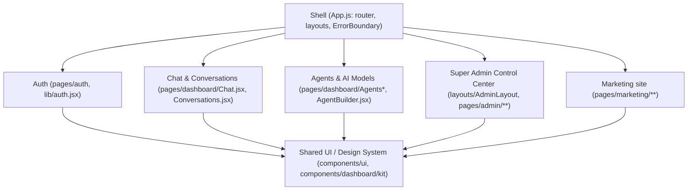

# OraOne — Frontend

Create React App (via CRACO for path aliases + a custom webpack health-check
plugin), deployed as a static build to GitHub Pages. 160+ route-level pages;
see [Routes](ROUTES.md) for the full page inventory.

## Bounded contexts (internal modularity)



These are the bounded contexts a runtime microfrontend split (Module
Federation) would otherwise invent from scratch. That split isn't done —
there's a single frontend team and a single deploy target today, so it
would add build/runtime complexity without a corresponding ownership
boundary to justify it.

## Directory structure

```
frontend/src/
  pages/           # route-level components, grouped by bounded context
    marketing/      admin/       dashboard/     auth/        onboarding/
    demos/          legal/       public/
  components/      # shared design system + feature-scoped components
    ui/             dashboard/   marketing/     admin/       auth/
  layouts/         # MarketingLayout, DashboardLayout, OnboardingLayout, AdminLayout, AuthShell
  lib/             # api client, auth context, seo hook, entitlements
  hooks/  services/  constants/
```

## Why CRA/CRACO, not Vite (yet)

A wholesale migration to Vite is technically straightforward but
deliberately deferred until a dedicated migration window exists (see
[Architecture → Deferred by design](ARCHITECTURE.md#deferred-by-design)).

## Why not Next.js

The marketing site is fully static, pre-rendered at build time by CRA, and
served from GitHub Pages with per-route SEO metadata injected via
`src/lib/seo.js` (`useSEO` hook). Next.js would only be justified for true
per-request SSR/ISR (e.g. dynamic marketing pages from a CMS) — not needed
today.

## GitHub Pages + client-side routing

GitHub Pages has no server-side rewrite rules, so a direct load of a
client-routed path (e.g. `oraone.in/products`) 404s by default. Solved with
the standard SPA-on-GitHub-Pages trick:

- `public/404.html` — served for any unknown path; round-trips the real
  path through a query string and redirects to `/`.
- `public/index.html` — a small inline script restores the real path via
  `history.replaceState` before React Router mounts.
- `public/CNAME` — pins the custom domain `oraone.in`.
- See [Deployment → DNS/TLS chain](DEPLOYMENT.md#dns--tls-chain) for the
  full chain.

## Brand identity

```
                         ORAONE
                           │
                    ┌──────┴──────┐
                    │             │
                MASTER         DERIVATIVE
                IDENTITY        ICON SYSTEM
                    │             │
              OraMark          AppIcon
           ("Chat Spark")   (Chat Spark in
                    │        a gradient tile)
             ┌──────┼──────┐      │
             │      │      │      │
          Light   Dark   Mono   App/Favicon
             │      │      │      │
             └──────┴──────┘      │
                    │             │
                    └──────┬──────┘
                           │
                      OraOne brand
```

- **`OraMark`** ("Chat Spark" — a rounded blue→cyan gradient speech-bubble
  silhouette with a 4-point white AI "spark" cut into it) is **the logo**.
  Use it anywhere a brand mark is shown at 32px or larger.
- **`AppIcon`** (the same mark, reversed to white, inside a solid gradient
  rounded-square tile) is a dedicated small-size/container derivative —
  favicon, PWA/home-screen icon, app-launcher icon, square social-profile
  slots. Never call it "the logo" in copy or code.
- Wordmark lockup: `[OraMark] OraOne` — "Ora" in `#0F172A` (or white on
  dark), "One" in `#2563EB`. Taglines are marketing copy, never baked into
  the permanent logo lockup.

| Size | Requirement |
|---|---|
| 16–24px | Use `AppIcon` — extra tile contrast needed to stay recognizable. |
| 32px | Either acceptable; `AppIcon` preferred for square icon slots. |
| 40px+ | Use `OraMark` directly — the primary logo everywhere else. |

| Token | Value | Usage |
|---|---|---|
| OraOne Blue | `#2563EB` | Gradient start, "One" in wordmark, primary buttons |
| OraOne Cyan | `#06B6D4` | Gradient end |
| OraOne Ink | `#0F172A` | "Ora" in wordmark, dark surfaces, headings |
| OraOne Surface | `#FFFFFF` | Light backgrounds, reversed/mono mark on dark |

Source: `frontend/src/components/marketing/Logo.jsx` — `OraMark` (master
mark), `AppIcon` (favicon/app-icon derivative), `Logo` (full lockup).
